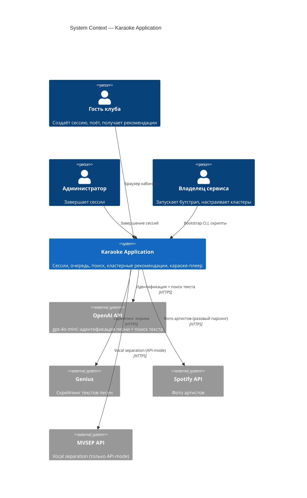
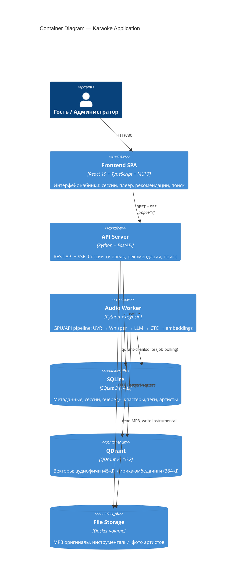
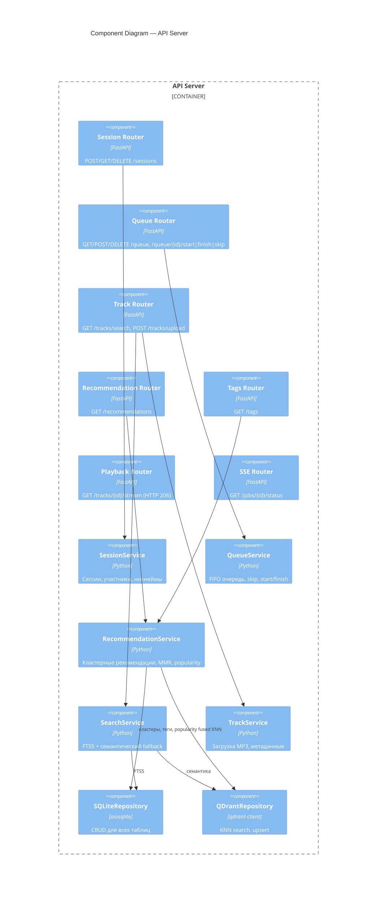
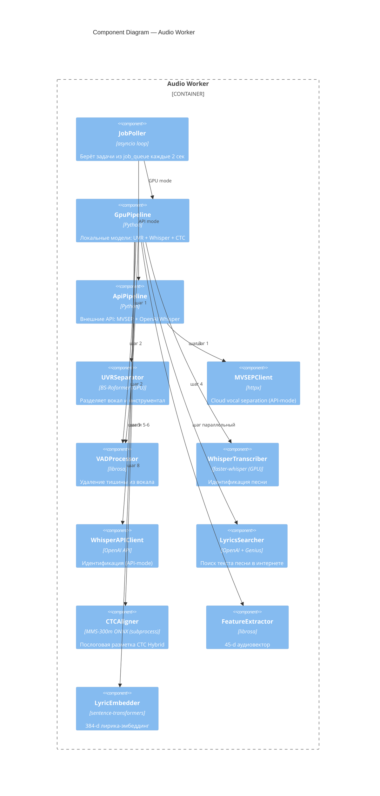

# Архитектура Karaoke Application

**Версия:** 2.0
**Дата:** 2026-03-20
**Статус:** Актуальна

---

## Содержание

1. [Обзор системы](#1-обзор-системы)
2. [C4 Model](#2-c4-model)
3. [Модули и их ответственность](#3-модули-и-их-ответственность)
4. [Даталогическая модель](#4-даталогическая-модель)
5. [Пайплайн обработки аудио](#5-пайплайн-обработки-аудио)
6. [Система рекомендаций](#6-система-рекомендаций)
7. [Структура проекта](#7-структура-проекта)
8. [Docker Compose](#8-docker-compose)
9. [API-контракт](#9-api-контракт)

---

## 1. Обзор системы

### Назначение

Karaoke Application — веб-приложение для караоке-кабинок. Группа гостей запускает сессию, ищет треки, получает рекомендации по настроению и поёт по очереди с послоговой подсветкой текста. Поддерживается загрузка пользовательских MP3 с автоматической генерацией караоке за ~2-3 минуты.

### Ключевые ограничения и решения

| Ограничение | Решение |
|---|---|
| Нет регистрации | Сессионная модель, никнеймы без persistence |
| Деплой в одну команду | Docker Compose (GPU и API варианты) |
| Каталог 17 000+ треков | QDrant + SQLite FTS5, K-Means кластеризация |
| Загрузка пользовательских треков | GPU: BS-Roformer + faster-whisper + CTC Hybrid. API: MVSEP + OpenAI Whisper |
| Минимальные затраты | GPU-сервер (~$50/мес) или API-mode (CPU VPS + $0.15-0.30/трек) |

### Домены

| Домен | Тип | Обоснование |
|---|---|---|
| Рекомендательная система | Core | Кластерный подход, теги настроения, MMR diversity |
| Сессии + очередь | Core | Бизнес-логика кабинки |
| Обработка аудио (worker) | Supporting | GPU/API pipeline: UVR → ASR → LLM → CTC alignment |
| Каталог + поиск | Supporting | FTS5 + семантический fallback |
| Админка | Generic | PIN-авторизация |

---

## 2. C4 Model

### 2.1 Context Diagram (Уровень 1)



### 2.2 Container Diagram (Уровень 2)



### 2.3 Component Diagram — API Server (Уровень 3)



### 2.4 Component Diagram — Audio Worker (Уровень 3)



---

## 3. Модули и их ответственность

### 3.1 SessionService

Управление сессиями кабинки и участниками.

```
create_session(room_id) -> Session
get_session(session_id) -> Session
terminate_session(session_id) -> None         # Admin, X-Admin-Secret
add_participant(session_id, name?) -> Participant  # Авто-никнейм если name пуст
get_participants(session_id) -> list[Participant]
```

Никнеймы: русскоязычные прилагательное + существительное, уникальные в рамках сессии.

### 3.2 QueueService

FIFO-очередь исполнения в сессии.

```
get_queue(session_id) -> list[QueueEntry]
add_to_queue(session_id, participant_id, track_id) -> QueueEntry
skip_turn(entry_id) -> QueueEntry             # Перемещает в конец
start_playing(entry_id) -> StartPlayingResponse  # clip_url + syllable_timings
finish_playing(entry_id) -> FinishPlayingResponse # play_history + counters
remove_from_queue(entry_id) -> None
```

### 3.3 RecommendationService

Кластерные рекомендации без регистрации.

**Стратегии:**

| Стратегия | Когда | Алгоритм |
|---|---|---|
| `POPULAR` | 0 треков в сессии | 70% хиты + 30% random, MMR diversity |
| `CLUSTER` | 1+ трек | Автокластеры сессии → slot distribution → KNN + popularity re-ranking + MMR |

**Автокластеры сессии:**
- Жадная кластеризация по fused cosine (аудио 0.7 + лирика 0.3)
- Порог: 0.7, макс. 3 кластера, одиночки вес 0.5
- 4 слота из кластеров + 1 exploration (anti-KNN)

**Popularity re-ranking:**
```
final_score = similarity * (1 + category_weight)
```

Категории: `eternal_hit` (1.0), `current_hit` (0.7), `artist_best` (0.7), `former_hit` (0.4), `regular` (0.1).

**MMR diversity:** λ=0.7 (70% relevance, 30% diversity penalty).

**Теги настроения:**
- `GET /tags?session_id=X` — теги от кластеров каталога, НЕ покрытых автокластерами сессии
- `GET /recommendations?tag_id=X` — KNN по центроиду кластера тега

### 3.4 SearchService

Гибридный поиск по каталогу.

```
search(query, limit, offset) -> SearchResult   # FTS5 primary + semantic fallback
suggest(query, limit) -> list[str]             # LIKE autocomplete
```

FTS5 по artist, title, lyrics_text. Если < 5 результатов и embedder доступен — семантический поиск по QDrant коллекции `lyrics_embeddings`.

### 3.5 TrackService

```
upload_mp3(content, artist?, title?) -> Track  # Сохраняет MP3, создаёт pending запись
get_track(track_id) -> Track
list_popular(limit) -> list[Track]
enqueue_processing(track_id) -> Job
```

### 3.6 JobService (shared)

SQLite-backed очередь задач с pessimistic locking.

```
create_job(track_id) -> Job
poll_and_lock(worker_id) -> Job | None         # Atomic SELECT + UPDATE
mark_step(job_id, step, progress) -> None      # SSE прогресс
mark_completed(job_id, result) -> None
mark_failed(job_id, error, retry?) -> None     # До 3 попыток
```

---

## 4. Даталогическая модель

### 4.1 SQLite

Все таблицы денормализованы. Foreign keys отключены. WAL mode. UUID генерируется приложением.

#### Таблица `tracks`

| Поле | Тип | Описание |
|---|---|---|
| `id` | TEXT PK | UUID |
| `artist` | TEXT NOT NULL | Исполнитель |
| `title` | TEXT NOT NULL | Название |
| `duration_sec` | INTEGER | Длительность |
| `mp3_path` | TEXT | Путь к MP3 (удаляется после обработки) |
| `instrumental_path` | TEXT | Путь к инструменталу |
| `clip_path` | TEXT | Legacy, nullable |
| `lyrics_text` | TEXT | Полный текст песни |
| `syllable_timings` | TEXT (JSON) | `[{syllable, start, end}]` |
| `language` | TEXT | "ru" / "en" / "other" |
| `source` | TEXT | "catalog" / "user_upload" |
| `status` | TEXT | "pending" / "processing" / "ready" / "error" |
| `error_message` | TEXT | Сообщение об ошибке |
| `play_count` | INTEGER DEFAULT 0 | Счётчик воспроизведений |
| `popularity_category` | TEXT | eternal_hit / current_hit / former_hit / artist_best / regular |
| `chart_count` | INTEGER DEFAULT 0 | Количество появлений в чартах |
| `chart_last_seen` | TEXT | Последнее появление в чарте |
| `catalog_cluster_id` | INTEGER | FK → catalog_clusters.id |
| `qdrant_synced` | INTEGER DEFAULT 0 | 1 если векторы в QDrant |
| `created_at` | TEXT (ISO8601) | |
| `updated_at` | TEXT (ISO8601) | |

#### Таблица `sessions`

| Поле | Тип | Описание |
|---|---|---|
| `id` | TEXT PK | UUID |
| `room_id` | TEXT NOT NULL | Идентификатор кабинки |
| `status` | TEXT | "active" / "terminated" |
| `created_at` | TEXT | |
| `terminated_at` | TEXT | |

#### Таблица `participants`

| Поле | Тип | Описание |
|---|---|---|
| `id` | TEXT PK | UUID |
| `session_id` | TEXT | FK → sessions.id |
| `display_name` | TEXT | Имя или авто-никнейм |
| `portrait_vector` | TEXT | Legacy, не используется |
| `lyrics_portrait_vector` | TEXT | Legacy, не используется |
| `tracks_played` | INTEGER DEFAULT 0 | |
| `created_at` | TEXT | |

#### Таблица `queue_entries`

| Поле | Тип | Описание |
|---|---|---|
| `id` | TEXT PK | UUID |
| `session_id` | TEXT | |
| `participant_id` | TEXT | |
| `track_id` | TEXT | |
| `order_position` | INTEGER | Позиция (1-based) |
| `status` | TEXT | "queued" / "playing" / "done" / "skipped" |
| `added_at` | TEXT | |
| `started_at` | TEXT | |
| `finished_at` | TEXT | |

#### Таблица `play_history`

| Поле | Тип | Описание |
|---|---|---|
| `id` | TEXT PK | UUID |
| `session_id` | TEXT | |
| `participant_id` | TEXT | |
| `track_id` | TEXT | |
| `played_at` | TEXT | |
| `completed` | INTEGER DEFAULT 0 | |

#### Таблица `job_queue`

| Поле | Тип | Описание |
|---|---|---|
| `id` | TEXT PK | UUID |
| `track_id` | TEXT | |
| `priority` | INTEGER DEFAULT 1 | 1-normal, 2-high |
| `status` | TEXT | "pending" / "running" / "completed" / "failed" |
| `attempts` | INTEGER DEFAULT 0 | |
| `max_attempts` | INTEGER DEFAULT 3 | |
| `locked_by` | TEXT | Worker ID |
| `locked_at` | TEXT | |
| `current_step` | TEXT | Текущий шаг pipeline |
| `progress` | INTEGER DEFAULT 0 | 0-100 |
| `result` | TEXT (JSON) | |
| `error_message` | TEXT | |
| `created_at` | TEXT | |
| `updated_at` | TEXT | |

#### Таблица `catalog_clusters`

| Поле | Тип | Описание |
|---|---|---|
| `id` | INTEGER PK AUTOINCREMENT | |
| `centroid_audio` | TEXT (JSON) | 45-d centroid |
| `centroid_lyrics` | TEXT (JSON) | 384-d centroid |
| `track_count` | INTEGER DEFAULT 0 | |
| `created_at` | TEXT | |
| `updated_at` | TEXT | |

#### Таблица `mood_tags`

| Поле | Тип | Описание |
|---|---|---|
| `id` | INTEGER PK AUTOINCREMENT | |
| `name` | TEXT NOT NULL | Название тега |
| `cluster_id` | INTEGER | FK → catalog_clusters.id |
| `created_at` | TEXT | |

UNIQUE(name, cluster_id)

#### Таблица `artists`

| Поле | Тип | Описание |
|---|---|---|
| `name` | TEXT PK | Имя артиста |
| `image_path` | TEXT | Путь к фото |
| `source` | TEXT | "spotify" / "yandex" / "placeholder" |
| `created_at` | TEXT | |
| `updated_at` | TEXT | |

#### Таблица `api_costs`

| Поле | Тип | Описание |
|---|---|---|
| `id` | INTEGER PK AUTOINCREMENT | |
| `track_id` | TEXT | |
| `service` | TEXT | Имя сервиса |
| `cost_usd` | REAL | Стоимость |
| `tokens` | INTEGER | |
| `duration_sec` | REAL | |
| `created_at` | TEXT | |

#### FTS5

```sql
CREATE VIRTUAL TABLE tracks_fts USING fts5(
    id UNINDEXED, artist, title, lyrics_text,
    content='tracks', content_rowid='rowid',
    tokenize='unicode61'
);
-- + триггеры AFTER INSERT/UPDATE/DELETE для синхронизации
```

### 4.2 QDrant Collections

#### `audio_features`

| Параметр | Значение |
|---|---|
| Размерность | 45 |
| Метрика | Cosine |
| Payload indexes | `status` (keyword), `language` (keyword), `source` (keyword) |

Вектор: MFCC (13) + Chroma (12) + Spectral Contrast (7) + Tonnetz (6) + scalars (7). Z-score нормализация + L2-renorm.

#### `lyrics_embeddings`

| Параметр | Значение |
|---|---|
| Размерность | 384 |
| Модель | `sentence-transformers/paraphrase-multilingual-MiniLM-L12-v2` |
| Метрика | Cosine |

---

## 5. Пайплайн обработки аудио

### 5.1 Worker — два режима

Worker выбирает pipeline по переменной `WORKER_MODE`:
- **gpu** — локальные модели на GPU (BS-Roformer, faster-whisper)
- **api** — внешние API (MVSEP, OpenAI Whisper)

### 5.2 Pipeline (10 шагов)

```
MP3 upload → API Server → job_queue (SQLite)

Worker берёт задачу:

┌─ Шаг 1: Stem Separation
│    GPU: BS-Roformer (SDR 12.9, ~60-90с на T4)
│    API: MVSEP API (sep_type=49, ~3 мин, ~$0.15)
│    → vocals.wav + instrumental.mp3
│
├─ Параллельно:
│  ├─ Ветка A: Feature Extraction (CPU, ~5с)
│  │    librosa → 45-d вектор → z-score → L2-renorm
│  │
│  └─ Ветка B: VAD + Transcription (последовательно)
│       ├─ VADProcessor: librosa silence removal → cleaned vocals
│       └─ Whisper: идентификация песни (язык + ~текст)
│            GPU: faster-whisper tiny (~5-10с)
│            API: OpenAI whisper-1
│
├─ Шаг 5: LyricsSearcher (OpenAI gpt-4o-mini)
│    Primary: identify → Genius search → scrape (~$0.0005)
│    Fallback: web_search_preview → scrape URLs (~$0.003)
│    → canonical artist, title, language, lyrics_text
│
├─ Шаги 6-7: CTC Forced Alignment (CPU, subprocess, ~22с)
│    MMS-300m ONNX → word-level → proportional syllable split
│    → syllable_timings JSON
│
├─ Шаг 8: Line Break Detection
│    librosa beat detection + gap analysis → \n маркеры
│
├─ Шаг 9: Lyric Embedding
│    sentence-transformers → 384-d вектор
│
└─ Шаг 10: QDrant Sync + Finalize
     upsert audio_features + lyrics_embeddings
     tracks.status → "ready"
     Удаление оригинального MP3
```

### 5.3 CTC Hybrid — ключевое решение

CTC Forced Aligner запускается в **отдельном subprocess** (изоляция от VRAM, защита от heap corruption). Word-level alignment через MMS-300m ONNX, затем proportional syllable split. MAE 0.240с, hit rate 71%, CPU-only, ~22с/трек.

---

## 6. Система рекомендаций

### 6.1 Два уровня кластеризации

**Кластеры каталога (предрассчитанные):**
- 17k+ треков → 15-20 K-Means кластеров по fused-векторам (audio + lyrics)
- Кластеры = вайбы ("гитарная меланхолия", "тяжёлый драйв", "хип-хоп")
- На каждый кластер 5-10 тегов настроения
- Пересчёт по крону

**Автокластеры сессии (динамические):**
- Жадная кластеризация спетых треков (порог cosine > 0.7)
- Макс. 3 кластера, одиночки вес 0.5
- Пересчитывается на лету при каждом запросе

### 6.2 Алгоритм рекомендаций (CLUSTER)

1. Собрать автокластеры сессии (центроиды)
2. Распределить (limit-1) слотов пропорционально весу кластеров
3. 1 слот → exploration (anti-KNN по популярным)
4. Для каждого слота: KNN по центроиду → oversample 4x
5. Popularity re-ranking: `score * (1 + category_weight)`
6. MMR selection: λ=0.7, штраф за похожесть с уже выбранными
7. Исключение спетых треков + опциональный фильтр по языку

### 6.3 Теги настроения

- 100-200 тегов на 15-20 кластеров каталога
- API отдаёт теги от кластеров, НЕ покрытых текущей сессией
- Нажатие тега → рекомендации из кластера этого тега
- Покрытие: cosine similarity центроидов > 0.7

---

## 7. Структура проекта

```
karaoke/
├── docker-compose.yml                # Base: qdrant + backend + frontend
├── docker-compose.gpu.yml            # GPU worker overlay
├── docker-compose.prod.yml           # Production bind mounts
├── Makefile                          # up-gpu, up-api, logs, test, health
├── .env.example                      # OPENAI_API_KEY, GENIUS_TOKEN, ADMIN_SECRET
├── master-promt.md                   # Описание проекта
├── conftest.py                       # pytest path setup
├── pytest.ini                        # asyncio_mode=auto
│
├── backend/
│   ├── app/
│   │   ├── main.py                   # FastAPI app, lifespan, CORS
│   │   ├── config.py                 # Pydantic Settings
│   │   ├── dependencies.py           # DI: repos, services, embedder
│   │   ├── api/
│   │   │   ├── router.py             # Сборный v1 роутер
│   │   │   └── v1/
│   │   │       ├── sessions.py       # /sessions
│   │   │       ├── queue.py          # /queue
│   │   │       ├── tracks.py         # /tracks
│   │   │       ├── recommendations.py # /recommendations
│   │   │       ├── tags.py           # /tags
│   │   │       ├── playback.py       # /tracks/{id}/stream
│   │   │       └── sse.py            # /jobs/{id}/status
│   │   ├── services/
│   │   │   ├── session_service.py
│   │   │   ├── queue_service.py
│   │   │   ├── track_service.py
│   │   │   ├── search_service.py
│   │   │   ├── recommendation_service.py
│   │   │   └── embedder.py
│   │   ├── models/                   # Pydantic request/response
│   │   ├── db/
│   │   │   └── init.sql              # Full schema + FTS5 + triggers
│   │   └── utils/
│   │       └── nicknames.py          # Генератор никнеймов
│   └── pyproject.toml
│
├── worker/
│   ├── app/
│   │   ├── main.py                   # Job poller, pipeline builder
│   │   └── config.py                 # Unified settings (GPU + API)
│   ├── gpu/
│   │   ├── gpu_pipeline.py           # 10-step GPU orchestration
│   │   ├── uvr_separator.py          # BS-Roformer wrapper
│   │   └── whisper_transcriber.py    # faster-whisper wrapper
│   ├── api/
│   │   ├── api_pipeline.py           # 10-step API orchestration
│   │   ├── mvsep_client.py           # MVSEP async client
│   │   ├── whisper_client.py         # OpenAI Whisper client
│   │   └── openai_embedder.py        # Optional OpenAI embeddings
│   ├── common/
│   │   ├── base_pipeline.py          # Abstract interface
│   │   ├── vad_processor.py          # librosa silence removal
│   │   ├── ctc_aligner.py            # Subprocess wrapper
│   │   ├── ctc_subprocess.py         # ONNX alignment (isolated process)
│   │   └── lyrics_searcher.py        # OpenAI + Genius multi-strategy
│   ├── entrypoint.sh
│   └── pyproject.toml                # [gpu] and [api] optional deps
│
├── shared/
│   └── karaoke_shared/
│       ├── constants.py              # Enums, dimensions, collection names
│       ├── models/                   # Domain models (Pydantic)
│       ├── repositories/             # SQLiteRepository, QDrantRepository
│       ├── services/                 # JobService
│       ├── ml/                       # FeatureExtractor, LyricEmbedder
│       └── utils/                    # syllabifier, line_breaker, vector
│
├── frontend/
│   ├── src/
│   │   ├── App.tsx                   # React Router: /, /session/:id/queue, /play/:entryId, /admin
│   │   ├── pages/
│   │   │   ├── WelcomePage/          # Landing → создание сессии
│   │   │   ├── QueuePage/            # Очередь + табы (поиск, рекомендации, загрузка)
│   │   │   ├── PlayerPage/           # Караоке-плеер с послоговой подсветкой
│   │   │   └── AdminPage/            # PIN → завершение сессии
│   │   ├── components/
│   │   │   ├── LyricHighlight.tsx    # rAF loop, прямая DOM-мутация, 60fps
│   │   │   ├── SearchTab.tsx         # Debounced search + suggestions
│   │   │   ├── UploadTab.tsx         # Drag-drop + SSE progress
│   │   │   ├── TrackCard.tsx         # Карточка трека
│   │   │   ├── QueueItem.tsx         # Элемент очереди
│   │   │   ├── AdminModal.tsx        # PIN numpad + состояния
│   │   │   └── CosmicBackground.tsx  # Анимированный фон
│   │   ├── services/
│   │   │   ├── api.ts                # Axios клиент (все endpoints)
│   │   │   └── sseService.ts         # EventSource для job progress
│   │   ├── store/                    # Zustand: sessionStore, queueStore
│   │   ├── theme/
│   │   │   └── darkTheme.ts          # MUI dark theme, glassmorphism
│   │   └── types/
│   │       └── index.ts              # TypeScript interfaces
│   └── package.json                  # React 19, MUI 7, Zustand 5
│
├── scripts/
│   ├── reindex_audio_features.py     # z-score нормализация QDrant
│   ├── cluster_catalog.py            # K-Means кластеризация каталога
│   ├── create_mood_tags.py           # Теги настроения
│   ├── parse_karaoke_charts.py       # Popularity scoring
│   ├── fetch_artist_images.py        # Фото из Spotify
│   ├── grab_mp3_links.py             # Парсер ссылок hitmotop
│   ├── download_mp3s.py              # Загрузчик MP3
│   └── find_tracks_for_artists.py    # Поиск треков в lrclib
│
├── docker/
│   ├── backend.Dockerfile
│   ├── frontend.Dockerfile           # Multi-stage node → nginx
│   ├── worker-gpu.Dockerfile         # CUDA 12.1 + cuDNN 8
│   └── worker-api.Dockerfile         # CPU-only + external APIs
│
├── tests/                            # pytest (unit + integration + e2e)
├── journals/                         # Документация проекта
├── design/prompts/                   # Промпты FigGPT (исторические)
└── m3_test/                          # Эксперименты CTC alignment
```

---

## 8. Docker Compose

### 8.1 Архитектура деплоя

```
                    ┌─────────────┐
                    │  Frontend   │ :80 (nginx)
                    │  React SPA  │ → /api/ proxy → backend:8000
                    └──────┬──────┘
                           │
                    ┌──────┴──────┐
                    │   Backend   │ :8000 (uvicorn)
                    │   FastAPI   │
                    └──┬──────┬───┘
                       │      │
              ┌────────┘      └────────┐
              │                        │
        ┌─────┴─────┐          ┌──────┴──────┐
        │   QDrant   │          │   Worker    │
        │  v1.16.2   │ :6333    │  GPU/API    │
        └────────────┘          └─────────────┘
              ↕                        ↕
         [vectors]              [SQLite + media]
```

### 8.2 Запуск

```bash
# GPU mode (выделенный сервер с NVIDIA GPU)
cp .env.example .env  # заполнить OPENAI_API_KEY, GENIUS_TOKEN
make up-gpu

# API mode (CPU VPS + внешние API)
make up-api

# Production (bind mounts вместо named volumes)
make up-gpu-prod
```

### 8.3 Сервисы

| Сервис | Образ | Порт | Healthcheck |
|---|---|---|---|
| qdrant | qdrant/qdrant:v1.16.2 | 6333 | TCP |
| backend | docker/backend.Dockerfile | 8000 | GET /health |
| frontend | docker/frontend.Dockerfile | 80 | GET / |
| worker | docker/worker-gpu.Dockerfile | — | — |

---

## 9. API-контракт

**Base URL:** `/api/v1`
**Content-Type:** `application/json`
**Admin auth:** `X-Admin-Secret` header

### Sessions

| Метод | Endpoint | Описание |
|---|---|---|
| POST | `/sessions` | Создать сессию `{room_id}` → 201 |
| GET | `/sessions/{id}` | Сессия + participants → 200 |
| POST | `/sessions/{id}/participants` | Добавить участника `{name?}` → 201 |
| DELETE | `/sessions/{id}` | Завершить (Admin) → 204 |

### Queue

| Метод | Endpoint | Описание |
|---|---|---|
| GET | `/sessions/{id}/queue` | Текущий + upcoming → 200 |
| POST | `/queue` | Добавить `{session_id, participant_id, track_id}` → 201 |
| POST | `/queue/{id}/skip` | Переместить в конец → 200 |
| POST | `/queue/{id}/start` | Начать → `{clip_url, syllable_timings, duration_sec}` |
| POST | `/queue/{id}/finish` | Завершить → `{next_participant, next_entry_id}` |
| DELETE | `/queue/{id}` | Удалить → 204 |

### Tracks

| Метод | Endpoint | Описание |
|---|---|---|
| GET | `/tracks/search?q=...&limit=20` | Гибридный поиск → `{total, items}` |
| GET | `/tracks/search/suggest?q=...` | Autocomplete → `[str]` |
| GET | `/tracks/{id}` | Детали трека → 200 |
| GET | `/tracks/popular?limit=10` | Популярные → 200 |
| POST | `/tracks/upload` | Загрузка MP3 (multipart, max 50MB) → 202 `{track_id, job_id}` |

### Playback

| Метод | Endpoint | Описание |
|---|---|---|
| GET | `/tracks/{id}/stream` | HTTP Range Request (instrumental) → 200/206 |

### Recommendations

| Метод | Endpoint | Описание |
|---|---|---|
| GET | `/recommendations?session_id=X&limit=5&tag_id=Y&language=ru` | Рекомендации → `{strategy, tracks[]}` |
| GET | `/tags?session_id=X&limit=8` | Теги настроения → `[{id, name}]` |

### Jobs (SSE)

| Метод | Endpoint | Описание |
|---|---|---|
| GET | `/jobs/{id}/status` | SSE stream: `status`, `completed`, `error` events |

### Health

| Метод | Endpoint | Описание |
|---|---|---|
| GET | `/health` | `{status, sqlite, qdrant}` → 200/503 |

---

## Приложение A: Технический стек

| Слой | Технология | Версия |
|---|---|---|
| Backend | FastAPI + aiosqlite | Python 3.12 |
| Vector DB | QDrant | v1.16.2 |
| Metadata DB | SQLite 3 (WAL, FTS5) | |
| Frontend | React + TypeScript + MUI | React 19, MUI 7 |
| State | Zustand | 5.x |
| Build | Vite | 7.x |
| Vocal separation (GPU) | BS-Roformer via audio-separator | SDR 12.9 |
| Vocal separation (API) | MVSEP | sep_type=49 |
| ASR (GPU) | faster-whisper | tiny model |
| ASR (API) | OpenAI Whisper | whisper-1 |
| Lyrics search | OpenAI gpt-4o-mini + Genius | |
| CTC alignment | ctc-forced-aligner (MMS-300m ONNX) | v1.0.2 |
| Audio features | librosa | 45-d vector |
| Lyrics embedding | sentence-transformers | paraphrase-multilingual-MiniLM-L12-v2 (384-d) |
| Syllabification | pyphen | ru_RU + en_US |
| Контейнеризация | Docker Compose | GPU + API variants |
| GPU runtime | CUDA 12.1 + cuDNN 8 | nvidia-container-toolkit |
