# Архитектура Karaoke Application

**Версия:** 1.0
**Дата:** 2026-02-22
**Статус:** Принята

---

## Содержание

1. [Обзор системы](#1-обзор-системы)
2. [C4 Model](#2-c4-model)
3. [Модули и их ответственность](#3-модули-и-их-ответственность)
4. [Даталогическая модель](#4-даталогическая-модель)
5. [Инфологическая модель](#5-инфологическая-модель)
6. [Диаграммы взаимодействия](#6-диаграммы-взаимодействия)
7. [Пайплайн обработки аудио](#7-пайплайн-обработки-аудио)
8. [Структура проекта](#8-структура-проекта)
9. [Docker Compose архитектура](#9-docker-compose-архитектура)
10. [API-контракт](#10-api-контракт)

---

## 1. Обзор системы

### Назначение

Karaoke Application — это веб-приложение для использования внутри кабинок в параоке-клубах. Система позволяет группе гостей запустить общую сессию, добавить участников, искать треки по словам из песни, получать персонализированные рекомендации и исполнять песни по очереди. Дополнительно система поддерживает загрузку пользовательских MP3 с автоматической генерацией карок-клипа за ~30 секунд.

### Ключевые ограничения

| Ограничение | Решение |
|---|---|
| Нет GPU | Sonoix API (аутсорс ASR), CPU-only librosa, UVR на CPU |
| Нет регистрации | Сессионные портреты, никнеймы без persistence |
| Деплой в одну команду | Docker Compose |
| Бутстрап 5000–10000 песен | WhisperX + lrc-lib (локальный дамп) + UVR оффлайн |
| < 30 сек на генерацию клипа | Sonoix API (через VPN из РФ) + async pipeline |
| Деплой в России | Внешние API (Sonoix и др.) через VPN (Amnezia WG / HideMyName) |

### Домены (DDD Classification)

| Домен | Тип | Обоснование инвестиций |
|---|---|---|
| Сессионное управление + очередь | Core | Уникальная бизнес-логика кабинки |
| Рекомендательная система | Core | Конкурентное преимущество |
| Пайплайн обработки аудио | Supporting | Важен, но используем готовые библиотеки |
| Каталог треков + поиск | Supporting | Стандартные паттерны, адаптированные под нас |
| Аутентификация admin | Generic | Минимальный токен, не усложнять |

---

## 2. C4 Model

### 2.1 Context Diagram (Уровень 1)

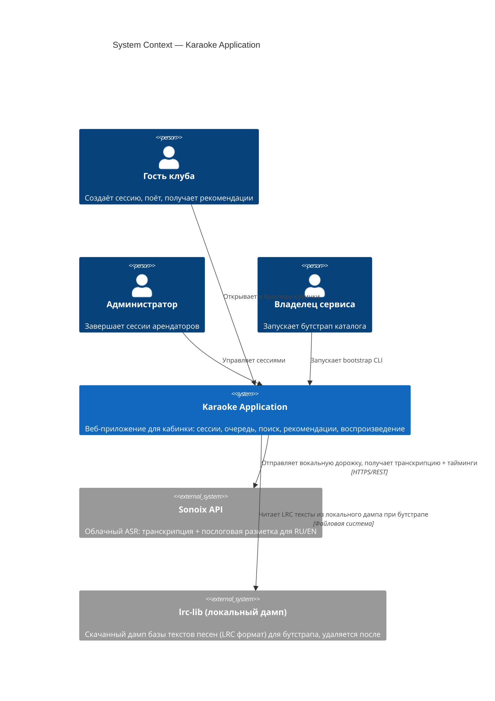

### 2.2 Container Diagram (Уровень 2)

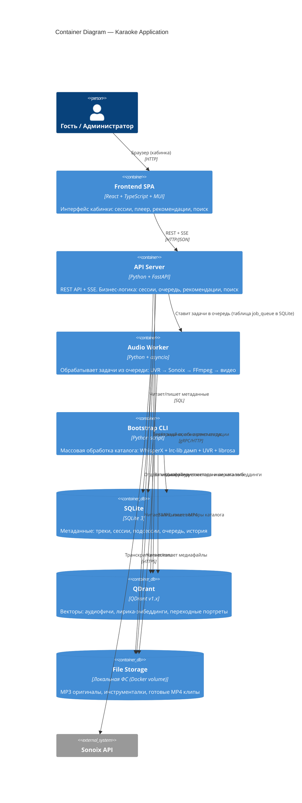

### 2.3 Component Diagram — API Server (Уровень 3)

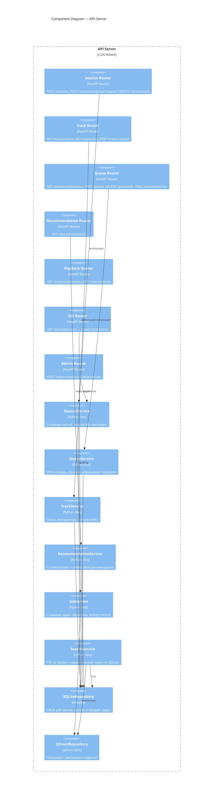

### 2.4 Component Diagram — Audio Worker (Уровень 3)

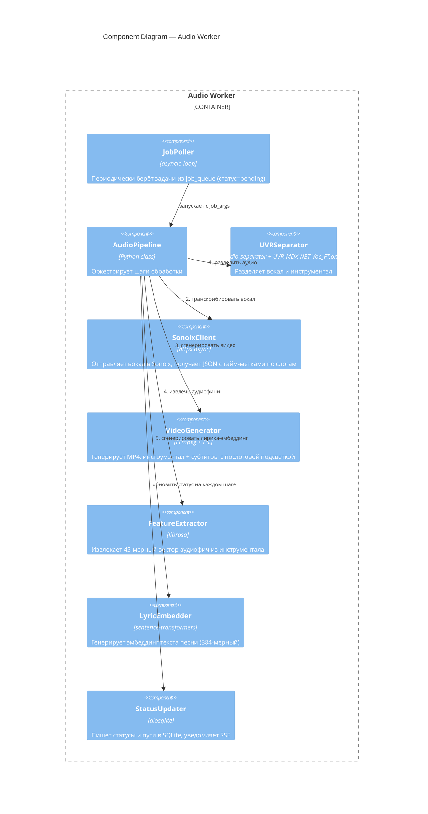

---

## 3. Модули и их ответственность

### 3.1 SessionService

**Ответственность:** управление жизненным циклом сессии кабинки и её участников.

**API:**
```
create_session(room_id: str) -> Session
get_session(session_id: str) -> Session
terminate_session(session_id: str) -> None      # Admin action
add_participant(session_id: str, name: str | None) -> Participant
get_participants(session_id: str) -> list[Participant]
generate_nickname() -> str                       # Возвращает случайный смешной никнейм
```

**Зависимости:** SQLiteRepository
**Примечания:** Никнеймы генерируются из предварительно составленного списка прилагательных + существительных (животные, предметы) без оскорбительных слов. Сессия хранит `room_id` для идентификации кабинки.

---

### 3.2 QueueService

**Ответственность:** управление очередью исполнения в рамках сессии.

**API:**
```
get_queue(session_id: str) -> list[QueueEntry]
add_to_queue(session_id: str, participant_id: str, track_id: str) -> QueueEntry
remove_from_queue(entry_id: str) -> None
skip_turn(entry_id: str) -> None        # Перемещает в конец, НЕ удаляет
get_current(session_id: str) -> QueueEntry | None
advance_queue(session_id: str) -> QueueEntry | None
```

**Зависимости:** SQLiteRepository
**Примечания:** Пропуск очереди (skip) не удаляет запись — участник перемещается в конец. Рекомендации остаются привязаны к участнику (participant_id), а не к позиции в очереди. Очередь — простой FIFO с явным полем `order_position`.

---

### 3.3 TrackService

**Ответственность:** каталог треков, метаданные, загрузка пользовательских MP3.

**API:**
```
get_track(track_id: str) -> Track
list_popular(limit: int = 10) -> list[Track]
upload_mp3(file: UploadFile, artist: str | None, title: str | None) -> Track
enqueue_processing(track_id: str) -> Job
get_job_status(job_id: str) -> Job
```

**Зависимости:** SQLiteRepository, JobService, FileStorage
**Примечания:** При загрузке пользователь может не заполнять поля artist/title — система делает их `"Unknown Artist"` / `"Unknown Track"`. Реальный artist/title будет распознан из транскрипции Sonoix и обновлён постфактум.

---

### 3.4 SearchService

**Ответственность:** гибридный поиск по каталогу.

**API:**
```
search(query: str, limit: int = 20, offset: int = 0) -> list[Track]
suggest(query: str, limit: int = 10) -> list[str]
semantic_search(query: str, limit: int = 20) -> list[Track]
```

**Реализация поиска:**
1. **FTS (основной)** — SQLite FTS5 по полям `artist`, `title`, `lyrics_text`. Нечёткий поиск через триграммы (SQLite расширение spellfix1 или альтернатива — Python rapidfuzz на уровне постобработки).
2. **Семантический поиск (дополнительный)** — когда FTS даёт < 5 результатов, выполняется векторный поиск по коллекции `lyrics_embeddings` в QDrant. Запрос эмбеддируется той же моделью (`sentence-transformers/paraphrase-multilingual-MiniLM-L12-v2`).
3. **Слияние результатов** — дедупликация по `track_id`, FTS-результаты приоритетнее.

**Зависимости:** SQLiteRepository, QDrantRepository

---

### 3.5 RecommendationService

**Ответственность:** рекомендации треков для участника без user ID.

**API:**
```
get_recommendations(
    participant_id: str,
    session_id: str,
    strategy: Literal["last", "last_two_avg", "session_avg", "popular"],
    limit: int = 10
) -> list[Track]
```

**Стратегии:**

| Стратегия | Когда применяется | Алгоритм |
|---|---|---|
| `popular` | История участника пуста | 10 самых воспроизведённых треков по полю `play_count` в SQLite |
| `last` | Исполнен 1+ трек | Поиск K ближайших соседей в QDrant по вектору последнего трека |
| `last_two_avg` | Исполнено 2+ трека | KNN по среднему арифметическому векторов двух последних треков |
| `session_avg` | Исполнено 3+ трека | KNN по среднему вектору всей истории участника в сессии |

**Векторный портрет участника** строится в реальном времени как скользящее среднее векторов исполненных треков. Живёт только в памяти сервиса (Redis-like кэш в FastAPI) и в поле `portrait_vector` таблицы `participants` в SQLite. При пропуске очереди (`skip`) портрет не изменяется.

**Коллаборативная составляющая (v1.1):** Граф переходов хранится в QDrant-коллекции `transitions` как пара `(from_track_id, to_track_id, weight)`. При наличии истории — к content-based результатам подмешиваются переходные рекомендации.

**Зависимости:** QDrantRepository, SQLiteRepository

---

### 3.6 JobService

**Ответственность:** управление задачами обработки аудио (аналог очереди задач на SQLite).

**API:**
```
create_job(track_id: str, priority: int = 1) -> Job
get_job(job_id: str) -> Job
list_pending_jobs(limit: int = 5) -> list[Job]
mark_running(job_id: str, worker_id: str) -> None
mark_completed(job_id: str, result: dict) -> None
mark_failed(job_id: str, error: str, retry: bool) -> None
```

**Реализация очереди:** Таблица `job_queue` в SQLite с полями `status`, `priority`, `created_at`, `locked_by`, `locked_at`. Worker берёт задачи через `SELECT ... WHERE status='pending' ORDER BY priority DESC, created_at ASC LIMIT 1` с UPDATE + pessimistic lock (`locked_by = worker_id`). Retry при сбое — до 3 попыток с экспоненциальной задержкой.

**SSE нотификации:** JobService пишет статус в SQLite. SSE endpoint у API-сервера делает long-polling или периодический `SELECT` из таблицы `job_queue` каждые 2 секунды и отправляет событие клиенту при смене статуса.

---

### 3.7 AudioPipeline (Worker)

**Ответственность:** полный пайплайн от MP3 до готового MP4 клипа.

**Шаги:**
1. `UVRSeparator.separate(mp3_path)` → `(vocals.wav, instrumental.wav)`
2. `SonoixClient.transcribe(vocals.wav)` → `syllable_timings: list[SyllableTiming]`
3. `VideoGenerator.generate(instrumental.wav, syllable_timings, artist, title)` → `clip.mp4`
4. `FeatureExtractor.extract(instrumental.wav)` → `vector[45]`
5. `LyricEmbedder.embed(full_text)` → `vector[384]`
6. Запись векторов в QDrant, обновление путей в SQLite

**Параллелизм:** Шаги 4 и 5 выполняются параллельно (asyncio.gather) после шага 3, так как не зависят друг от друга.

---

### 3.8 BootstrapCLI

**Ответственность:** разовая массовая загрузка 5000–10000 треков в каталог.

**Пайплайн для каждого трека:**
1. UVR разделение (CPU)
2. Поиск LRC в локальном дампе lrc-lib (по artist + title)
3. Если LRC найден: WhisperX с force-align по имеющемуся тексту → точные тайминги по словам → разбивка по слогам простым алгоритмом
4. Если LRC не найден: WhisperX полная транскрипция с word timestamps
5. VideoGenerator (те же компоненты, что и в online-пайплайне)
6. FeatureExtractor + LyricEmbedder
7. Запись в SQLite + QDrant

**Параллелизм:** `multiprocessing.Pool` с N воркерами (N = CPU cores — 1). Прогресс через `tqdm`.

---

## 4. Даталогическая модель

### 4.1 SQLite

Все таблицы денормализованы. Внешние ключи отсутствуют (ссылочная целостность обеспечивается прикладным кодом). UUID генерируется на уровне приложения (`uuid4`).

#### Таблица `tracks`

| Поле | Тип | NULL | Описание |
|---|---|---|---|
| `id` | TEXT (UUID) | NOT NULL | PK |
| `artist` | TEXT | NOT NULL | Исполнитель |
| `title` | TEXT | NOT NULL | Название |
| `duration_sec` | INTEGER | NULL | Длительность в секундах |
| `mp3_path` | TEXT | NULL | Путь к исходному MP3 |
| `instrumental_path` | TEXT | NULL | Путь к инструментальной дорожке WAV |
| `clip_path` | TEXT | NULL | Путь к готовому MP4 клипу |
| `lyrics_text` | TEXT | NULL | Полный текст песни (для FTS и эмбеддинга) |
| `syllable_timings` | TEXT (JSON) | NULL | JSON массив `[{syllable, start, end}]` |
| `language` | TEXT | NULL | "ru" / "en" / "other" |
| `source` | TEXT | NOT NULL | "catalog" / "user_upload" |
| `status` | TEXT | NOT NULL | "pending" / "processing" / "ready" / "error" |
| `error_message` | TEXT | NULL | Сообщение об ошибке обработки |
| `play_count` | INTEGER | NOT NULL DEFAULT 0 | Счётчик воспроизведений |
| `qdrant_synced` | INTEGER | NOT NULL DEFAULT 0 | 1 если векторы записаны в QDrant |
| `created_at` | TEXT (ISO8601) | NOT NULL | Время создания записи |
| `updated_at` | TEXT (ISO8601) | NOT NULL | Время последнего обновления |

**Индексы:**
```sql
CREATE INDEX idx_tracks_status ON tracks(status);
CREATE INDEX idx_tracks_source ON tracks(source);
CREATE INDEX idx_tracks_play_count ON tracks(play_count DESC) WHERE status = 'ready';
CREATE INDEX idx_tracks_artist_title ON tracks(artist, title);

-- FTS5 виртуальная таблица
CREATE VIRTUAL TABLE tracks_fts USING fts5(
    track_id UNINDEXED,
    artist,
    title,
    lyrics_text,
    content='tracks',
    content_rowid='rowid',
    tokenize='unicode61'
);
-- Триггеры для синхронизации FTS
CREATE TRIGGER tracks_ai AFTER INSERT ON tracks BEGIN
    INSERT INTO tracks_fts(rowid, track_id, artist, title, lyrics_text)
    VALUES (new.rowid, new.id, new.artist, new.title, new.lyrics_text);
END;
CREATE TRIGGER tracks_au AFTER UPDATE ON tracks BEGIN
    INSERT INTO tracks_fts(tracks_fts, rowid, track_id, artist, title, lyrics_text)
    VALUES ('delete', old.rowid, old.id, old.artist, old.title, old.lyrics_text);
    INSERT INTO tracks_fts(rowid, track_id, artist, title, lyrics_text)
    VALUES (new.rowid, new.id, new.artist, new.title, new.lyrics_text);
END;
```

---

#### Таблица `sessions`

| Поле | Тип | NULL | Описание |
|---|---|---|---|
| `id` | TEXT (UUID) | NOT NULL | PK |
| `room_id` | TEXT | NOT NULL | Идентификатор кабинки (строка, задаётся при деплое) |
| `status` | TEXT | NOT NULL | "active" / "terminated" |
| `created_at` | TEXT (ISO8601) | NOT NULL | |
| `terminated_at` | TEXT (ISO8601) | NULL | Время завершения администратором |

**Индексы:**
```sql
CREATE INDEX idx_sessions_room_status ON sessions(room_id, status);
```

---

#### Таблица `participants`

| Поле | Тип | NULL | Описание |
|---|---|---|---|
| `id` | TEXT (UUID) | NOT NULL | PK |
| `session_id` | TEXT (UUID) | NOT NULL | Ссылка на `sessions.id` |
| `display_name` | TEXT | NOT NULL | Имя или автосгенерированный никнейм |
| `portrait_vector` | TEXT (JSON) | NULL | JSON float[] — вектор интересов участника (45 + 384 = 429 мерный, или только 45) |
| `tracks_played` | INTEGER | NOT NULL DEFAULT 0 | Количество исполненных треков |
| `created_at` | TEXT (ISO8601) | NOT NULL | |

**Индексы:**
```sql
CREATE INDEX idx_participants_session ON participants(session_id);
```

---

#### Таблица `queue_entries`

| Поле | Тип | NULL | Описание |
|---|---|---|---|
| `id` | TEXT (UUID) | NOT NULL | PK |
| `session_id` | TEXT (UUID) | NOT NULL | Ссылка на `sessions.id` |
| `participant_id` | TEXT (UUID) | NOT NULL | Ссылка на `participants.id` |
| `track_id` | TEXT (UUID) | NOT NULL | Ссылка на `tracks.id` |
| `order_position` | INTEGER | NOT NULL | Позиция в очереди (1-based) |
| `status` | TEXT | NOT NULL | "queued" / "playing" / "done" / "skipped" |
| `added_at` | TEXT (ISO8601) | NOT NULL | |
| `started_at` | TEXT (ISO8601) | NULL | |
| `finished_at` | TEXT (ISO8601) | NULL | |

**Индексы:**
```sql
CREATE INDEX idx_queue_session_status ON queue_entries(session_id, status, order_position);
```

---

#### Таблица `play_history`

| Поле | Тип | NULL | Описание |
|---|---|---|---|
| `id` | TEXT (UUID) | NOT NULL | PK |
| `session_id` | TEXT (UUID) | NOT NULL | |
| `participant_id` | TEXT (UUID) | NOT NULL | |
| `track_id` | TEXT (UUID) | NOT NULL | |
| `played_at` | TEXT (ISO8601) | NOT NULL | Время начала воспроизведения |
| `completed` | INTEGER | NOT NULL DEFAULT 0 | 1 если дослушал до конца |

**Индексы:**
```sql
CREATE INDEX idx_history_participant ON play_history(participant_id, played_at DESC);
CREATE INDEX idx_history_session ON play_history(session_id);
CREATE INDEX idx_history_track ON play_history(track_id);
```

---

#### Таблица `job_queue`

| Поле | Тип | NULL | Описание |
|---|---|---|---|
| `id` | TEXT (UUID) | NOT NULL | PK |
| `track_id` | TEXT (UUID) | NOT NULL | Ссылка на `tracks.id` |
| `priority` | INTEGER | NOT NULL DEFAULT 1 | 1=normal, 2=high, 3=urgent |
| `status` | TEXT | NOT NULL | "pending" / "running" / "completed" / "failed" |
| `attempts` | INTEGER | NOT NULL DEFAULT 0 | Число попыток |
| `max_attempts` | INTEGER | NOT NULL DEFAULT 3 | |
| `locked_by` | TEXT | NULL | ID воркера, взявшего задачу |
| `locked_at` | TEXT (ISO8601) | NULL | Время блокировки |
| `result` | TEXT (JSON) | NULL | JSON с результатом (clip_path, duration и т.д.) |
| `error_message` | TEXT | NULL | |
| `created_at` | TEXT (ISO8601) | NOT NULL | |
| `updated_at` | TEXT (ISO8601) | NOT NULL | |

**Индексы:**
```sql
CREATE INDEX idx_jobs_status_priority ON job_queue(status, priority DESC, created_at ASC)
    WHERE status = 'pending';
```

---

### 4.2 QDrant Collections

#### Коллекция `audio_features`

**Назначение:** векторы аудиофич треков для content-based рекомендаций.

| Параметр | Значение |
|---|---|
| Размерность | 45 |
| Метрика расстояния | Cosine |
| Квантизация | Scalar (INT8) — экономия памяти |

**Payload полей записи:**
```json
{
  "track_id": "uuid",
  "artist": "string",
  "title": "string",
  "language": "ru|en|other",
  "source": "catalog|user_upload",
  "play_count": 42,
  "duration_sec": 213,
  "status": "ready"
}
```

**Индексы payload:** `status` (keyword), `language` (keyword), `source` (keyword).

---

#### Коллекция `lyrics_embeddings`

**Назначение:** семантический поиск по смыслу текста песни и рекомендации по лирике.

| Параметр | Значение |
|---|---|
| Размерность | 384 |
| Модель | `sentence-transformers/paraphrase-multilingual-MiniLM-L12-v2` |
| Метрика расстояния | Cosine |

**Payload:** идентичен `audio_features`.

---

#### Коллекция `transitions`

**Назначение:** граф переходов A → B (коллаборативные рекомендации).

| Параметр | Значение |
|---|---|
| Размерность | 45 (вектор from_track, используется для ANN поиска «от какой песни переходили к похожим») |
| Метрика расстояния | Cosine |

**Payload:**
```json
{
  "from_track_id": "uuid",
  "to_track_id": "uuid",
  "weight": 0.87,
  "transition_count": 14
}
```

**Примечание:** Коллекция строится постепенно по мере накопления данных play_history в рамках сессий. При бутстрапе пустая.

---

## 5. Инфологическая модель

### ER-диаграмма

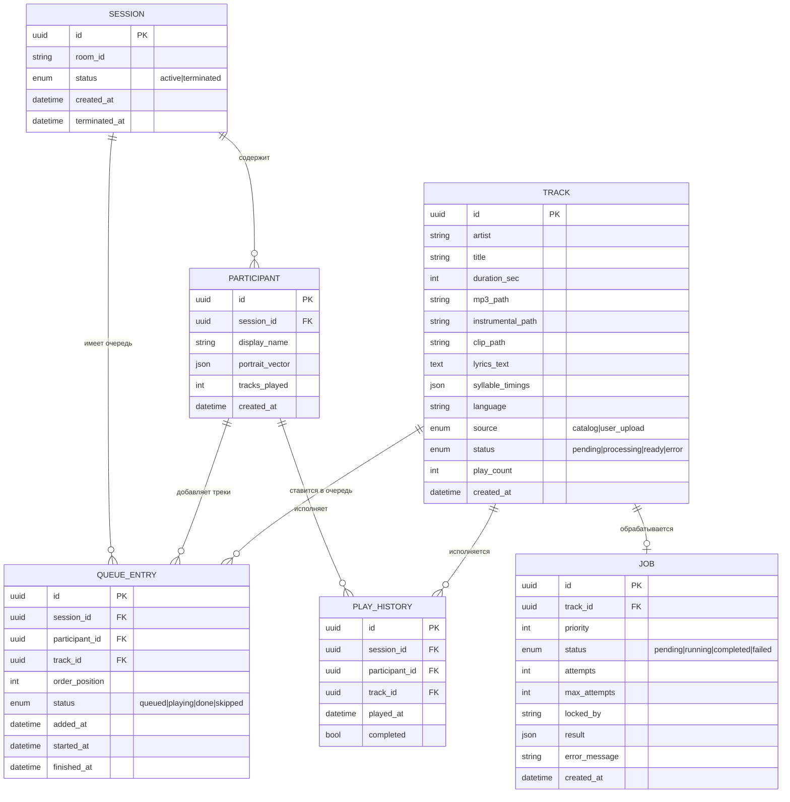

### Жизненный цикл трека

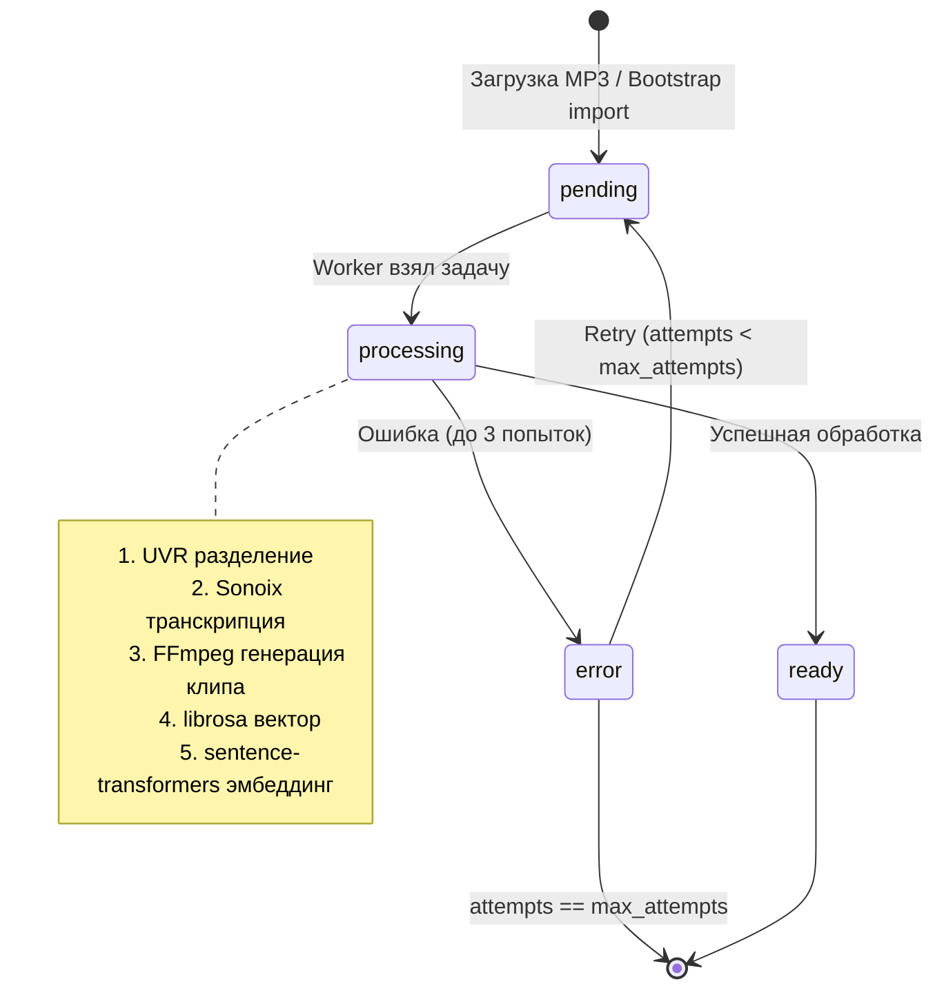

### Жизненный цикл сессии

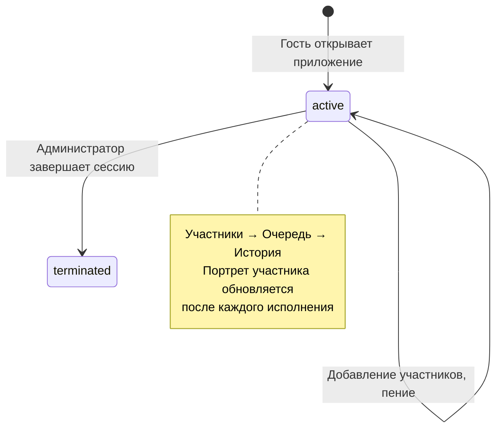

---

## 6. Диаграммы взаимодействия

### 6.1 Создание сессии и добавление участника

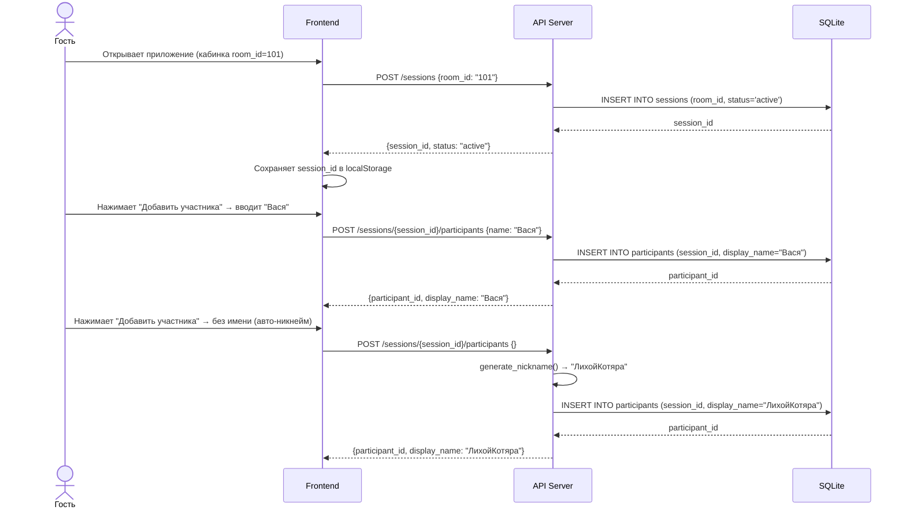

### 6.2 Поиск и выбор трека

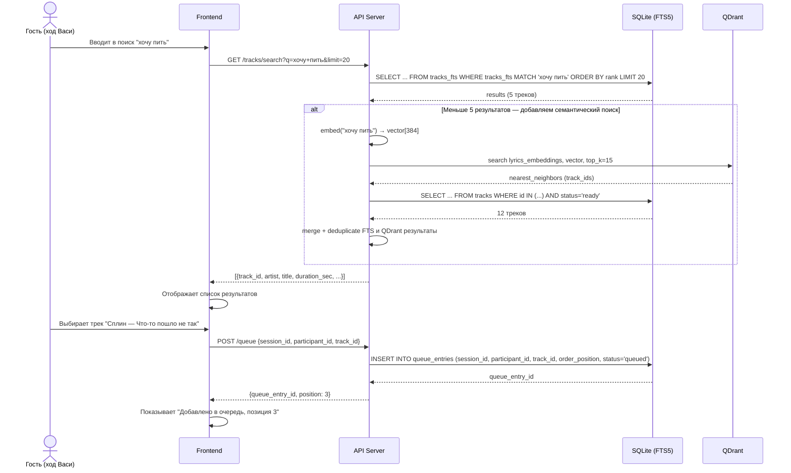

### 6.3 Загрузка MP3 и генерация клипа

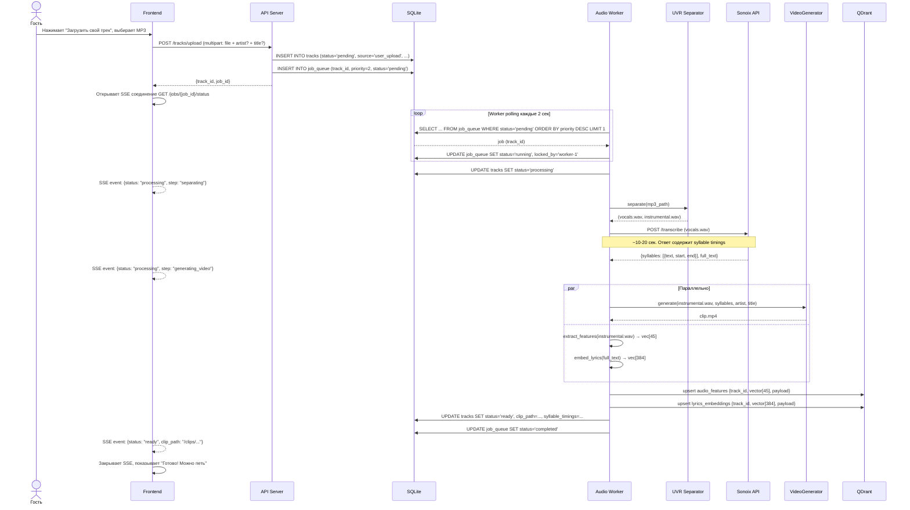

### 6.4 Получение рекомендаций

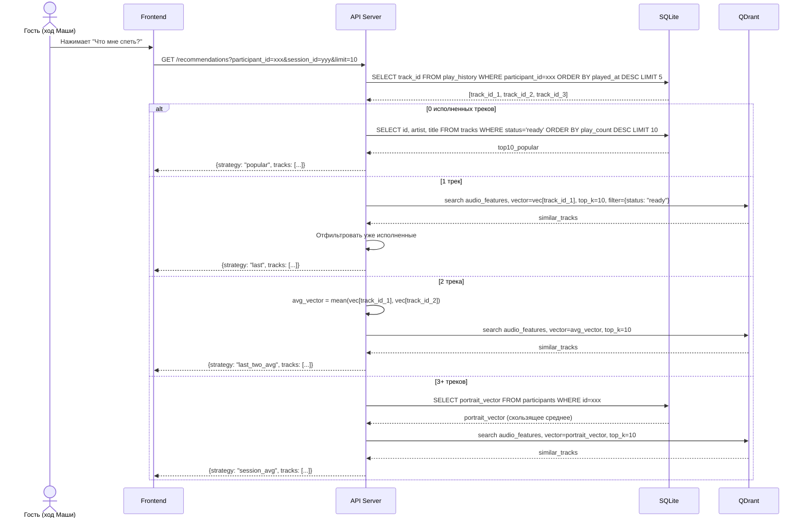

### 6.5 Воспроизведение карок-клипа

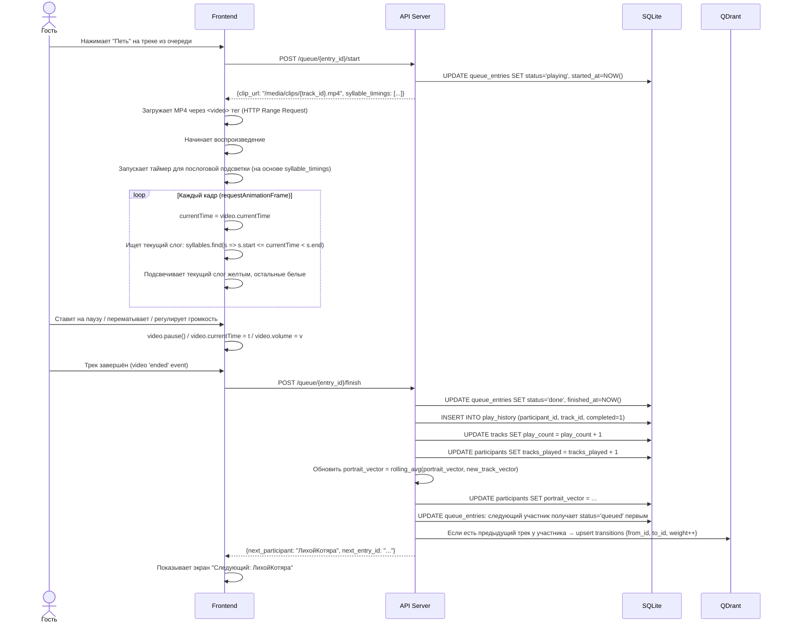

---

## 7. Пайплайн обработки аудио

### 7.1 Online Pipeline (загрузка пользователем, < 30 сек)

```
MP3 upload
    │
    ▼
[API Server]
    │ INSERT track (status=pending)
    │ INSERT job_queue (priority=2, URGENT)
    ▼
[Audio Worker]  ←── берёт задачу из job_queue
    │
    ├─── Step 1: UVR Separator (CPU, ~5-8 сек для 3-мин трека)
    │         audio-separator + UVR-MDX-NET-Voc_FT.onnx
    │         mp3 → vocals.wav + instrumental.wav
    │
    ├─── Step 2: Sonoix API (~3-7 сек, зависит от сети)
    │         POST /api/transcribe с vocals.wav (< 30MB)
    │         Ответ: [{syllable, start_ms, end_ms}] + full_text
    │
    ├─── Step 3: VideoGenerator (CPU+FFmpeg, ~5-10 сек)
    │         PIL: рендер кадров с текстом (или subtitle filter в FFmpeg)
    │         FFmpeg: combine instrumental + субтитры → .mp4 (H.264 + AAC)
    │         Используется ASS/SRT формат с послоговой разбивкой
    │
    ├─── Step 4+5 (параллельно):
    │         4a: librosa.extract_features(instrumental.wav) → float[45]
    │         4b: sentence_transformer.encode(full_text) → float[384]
    │
    ├─── Step 6: QDrant upsert
    │         audio_features ← {track_id, vector[45], payload}
    │         lyrics_embeddings ← {track_id, vector[384], payload}
    │
    └─── Step 7: SQLite update
              tracks: status=ready, clip_path, syllable_timings (JSON), lyrics_text
              job_queue: status=completed

SSE ──► Клиент получает статус на каждом шаге
```

**Целевое время end-to-end:** 18–30 секунд для трека до 4 минут.

**Бутылочные горлышки:**
- UVR на CPU: ~5–8 сек (можно оптимизировать через уменьшение chunk_size)
- Sonoix API: зависит от внешней сети, можно поднять timeout до 60 сек
- VideoGenerator: FFmpeg subtitle filter вместо кадро-за-кадром PIL (в 5-10 раз быстрее)

---

### 7.2 Bootstrap Pipeline (разовая операция, CPU)

```
Директория с MP3 файлами (5000–10000 треков)
    │
    ▼
bootstrap_cli.py --input-dir /data/songs --workers 7
    │
    ├─── Параллельно через multiprocessing.Pool(N)
    │
    │    Для каждого трека:
    │    │
    │    ├─── 1. UVR разделение (CPU)
    │    │        vocals.wav + instrumental.wav
    │    │
    │    ├─── 2. Получение текста:
    │    │        а. Поиск в локальном дампе lrc-lib (SQLite по artist+title)
    │    │           Если найден → парсим LRC, получаем построчные тайминги
    │    │           WhisperX force-align(audio, text) → word timestamps
    │    │           Простой алгоритм слогоделения → syllable timings
    │    │        б. Если в дампе не найден:
    │    │           WhisperX transcribe(vocals.wav, language='ru') с word_timestamps=True
    │    │           Простой алгоритм слогоделения
    │    │
    │    ├─── 3. VideoGenerator (FFmpeg, те же компоненты)
    │    │
    │    ├─── 4. FeatureExtractor (librosa) → float[45]
    │    │
    │    ├─── 5. LyricEmbedder (sentence-transformers) → float[384]
    │    │
    │    ├─── 6. SQLite INSERT track (status=ready)
    │    │
    │    └─── 7. QDrant upsert (batch по 100 треков)
    │
    └─── tqdm прогресс-бар + лог ошибок в bootstrap_errors.log
```

**Оценка времени:** ~1–2 мин на трек на CPU. 10000 треков с 7 воркерами: ~24–48 часов. Рекомендуется запускать ночью или несколько ночей последовательно.

**Алгоритм слогоделения:** простой, основанный на правилах (гласные как ядра слогов, согласные распределяются по правилам RU/EN). Реализуется функцией ~50 строк. Для русского: библиотека `pyphen` с словарём `ru_RU`. Для английского: `pyphen` с `en_US`.

---

## 8. Структура проекта

```
karaoke/
├── docker-compose.yml
├── docker-compose.override.yml        # для dev (volumes, hot-reload)
├── .env.example
├── .env                               # не в git
│
├── backend/                           # FastAPI сервер
│   ├── Dockerfile
│   ├── pyproject.toml                 # зависимости (poetry или uv)
│   ├── alembic/                       # НЕ используем (SQLite + ручные миграции)
│   │
│   └── app/
│       ├── main.py                    # FastAPI app, middleware, роутеры
│       ├── config.py                  # Pydantic Settings (из .env)
│       ├── dependencies.py            # FastAPI Depends: db, qdrant, etc.
│       │
│       ├── api/                       # HTTP слой
│       │   ├── v1/
│       │   │   ├── sessions.py        # /sessions
│       │   │   ├── tracks.py          # /tracks
│       │   │   ├── queue.py           # /queue
│       │   │   ├── recommendations.py # /recommendations
│       │   │   ├── playback.py        # /media (range requests)
│       │   │   ├── sse.py             # /jobs/{id}/status SSE
│       │   │   └── admin.py           # /admin
│       │   └── router.py              # Сборный роутер v1
│       │
│       ├── services/                  # Бизнес-логика
│       │   ├── session_service.py
│       │   ├── queue_service.py
│       │   ├── track_service.py
│       │   ├── search_service.py
│       │   ├── recommendation_service.py
│       │   └── job_service.py
│       │
│       ├── repositories/              # Слой доступа к данным
│       │   ├── sqlite_repository.py   # aiosqlite CRUD
│       │   └── qdrant_repository.py   # qdrant-client операции
│       │
│       ├── models/                    # Pydantic схемы (request/response)
│       │   ├── session.py
│       │   ├── track.py
│       │   ├── queue.py
│       │   ├── recommendation.py
│       │   └── job.py
│       │
│       ├── db/
│       │   ├── init.sql               # CREATE TABLE statements
│       │   └── migrations/            # Ручные SQL-файлы (001_init.sql, ...)
│       │
│       └── utils/
│           ├── nicknames.py           # Генератор никнеймов
│           └── slugify.py
│
├── worker/                            # Audio Worker
│   ├── Dockerfile
│   ├── pyproject.toml
│   │
│   └── app/
│       ├── main.py                    # asyncio loop + poller
│       ├── config.py
│       │
│       ├── pipeline/
│       │   ├── audio_pipeline.py      # Оркестратор шагов
│       │   ├── uvr_separator.py       # UVR через audio-separator
│       │   ├── sonoix_client.py       # httpx клиент Sonoix API
│       │   ├── video_generator.py     # FFmpeg + PIL субтитры
│       │   ├── feature_extractor.py   # librosa → float[45]
│       │   └── lyric_embedder.py      # sentence-transformers → float[384]
│       │
│       └── repositories/
│           ├── sqlite_repository.py   # Те же методы что в backend (можно вынести в shared)
│           └── qdrant_repository.py
│
├── bootstrap/                         # Bootstrap CLI
│   ├── Dockerfile                     # Отдельный образ (тяжёлый: whisperX)
│   ├── pyproject.toml
│   │
│   └── app/
│       ├── cli.py                     # argparse / typer CLI
│       ├── bootstrap_runner.py        # multiprocessing.Pool оркестратор
│       ├── pipeline/                  # Переиспользует компоненты из worker/
│       │   ├── uvr_separator.py       # симлинк или shared package
│       │   ├── whisperx_transcriber.py
│       │   ├── lrclib_dump.py          # Поиск по локальному дампу lrc-lib (SQLite)
│       │   ├── syllabifier.py         # pyphen-based слогоделение
│       │   ├── video_generator.py
│       │   ├── feature_extractor.py
│       │   └── lyric_embedder.py
│       └── utils/
│           └── progress.py            # tqdm + logging
│
├── frontend/                          # React SPA
│   ├── Dockerfile
│   ├── package.json
│   ├── tsconfig.json
│   ├── vite.config.ts
│   │
│   └── src/
│       ├── main.tsx
│       ├── App.tsx
│       │
│       ├── pages/
│       │   ├── WelcomePage/           # Создание сессии, добавление участников
│       │   ├── QueuePage/             # Очередь, текущий исполнитель
│       │   ├── SearchPage/            # Поиск + рекомендации + загрузка MP3
│       │   ├── PlayerPage/            # Воспроизведение с послоговой подсветкой
│       │   └── AdminPage/             # Завершение сессии
│       │
│       ├── components/
│       │   ├── KaraokePlayer/         # <video> обёртка + субтитры overlay
│       │   ├── LyricHighlight/        # Послоговая подсветка
│       │   ├── TrackCard/
│       │   ├── QueueItem/
│       │   ├── ParticipantChip/
│       │   └── UploadTrackDialog/     # Диалог загрузки MP3 + SSE прогресс
│       │
│       ├── services/
│       │   ├── api.ts                 # axios клиент
│       │   ├── sseService.ts          # EventSource обёртка
│       │   └── playerService.ts       # Логика плеера
│       │
│       ├── store/
│       │   ├── sessionStore.ts        # Zustand
│       │   ├── queueStore.ts
│       │   └── playerStore.ts
│       │
│       └── theme/
│           └── darkTheme.ts           # MUI тёмная тема
│
├── shared/                            # Общий Python пакет (опционально)
│   └── karaoke_shared/
│       ├── repositories/              # Переиспользуемые репозитории
│       └── models/                    # Dataclasses/Pydantic модели
│
└── data/                              # Docker volumes (в .gitignore)
    ├── sqlite/
    │   └── karaoke.db
    ├── qdrant/
    ├── media/
    │   ├── uploads/                   # Исходные MP3
    │   ├── instrumental/              # Инструменталки WAV
    │   ├── clips/                     # Готовые MP4
    │   └── catalog/                   # Каталог для бутстрапа
    └── models/
        └── UVR-MDX-NET-Voc_FT.onnx   # Скачивается при первом запуске
```

---

## 9. Docker Compose архитектура

### docker-compose.yml

```yaml
version: "3.9"

services:

  # --- Векторная БД ---
  qdrant:
    image: qdrant/qdrant:v1.8.0
    container_name: karaoke_qdrant
    restart: unless-stopped
    volumes:
      - qdrant_data:/qdrant/storage
    ports:
      - "6333:6333"   # REST API (только для разработки/debug)
      - "6334:6334"   # gRPC
    environment:
      QDRANT__SERVICE__HTTP_PORT: 6333
    healthcheck:
      test: ["CMD", "curl", "-f", "http://localhost:6333/healthz"]
      interval: 10s
      timeout: 5s
      retries: 5

  # --- API сервер ---
  backend:
    build:
      context: ./backend
      dockerfile: Dockerfile
    container_name: karaoke_backend
    restart: unless-stopped
    depends_on:
      qdrant:
        condition: service_healthy
    environment:
      DATABASE_URL: /data/sqlite/karaoke.db
      QDRANT_HOST: qdrant
      QDRANT_PORT: 6333
      MEDIA_ROOT: /data/media
      ADMIN_SECRET: ${ADMIN_SECRET}
      LOG_LEVEL: INFO
    volumes:
      - sqlite_data:/data/sqlite
      - media_data:/data/media
    ports:
      - "8000:8000"
    healthcheck:
      test: ["CMD", "curl", "-f", "http://localhost:8000/health"]
      interval: 10s
      timeout: 5s
      retries: 5

  # --- Audio Worker ---
  worker:
    build:
      context: ./worker
      dockerfile: Dockerfile
    container_name: karaoke_worker
    restart: unless-stopped
    depends_on:
      backend:
        condition: service_healthy
      qdrant:
        condition: service_healthy
    environment:
      DATABASE_URL: /data/sqlite/karaoke.db
      QDRANT_HOST: qdrant
      QDRANT_PORT: 6333
      MEDIA_ROOT: /data/media
      SONOIX_API_KEY: ${SONOIX_API_KEY}
      SONOIX_API_URL: https://api.sonoix.com
      AUDIO_SEPARATOR_MODEL: UVR-MDX-NET-Voc_FT.onnx
      MODEL_CACHE_DIR: /data/models
      WORKER_POLL_INTERVAL: 2        # секунды
      WORKER_MAX_CONCURRENT: 2       # параллельных задач
    volumes:
      - sqlite_data:/data/sqlite
      - media_data:/data/media
      - models_data:/data/models
    # Нет публичных портов — внутренний сервис

  # --- Frontend SPA ---
  frontend:
    build:
      context: ./frontend
      dockerfile: Dockerfile
      args:
        VITE_API_BASE_URL: /api
    container_name: karaoke_frontend
    restart: unless-stopped
    depends_on:
      - backend
    # nginx внутри контейнера отдаёт статику
    # и проксирует /api → backend:8000

  # --- Nginx reverse proxy ---
  nginx:
    image: nginx:alpine
    container_name: karaoke_nginx
    restart: unless-stopped
    depends_on:
      - frontend
      - backend
    ports:
      - "80:80"
    volumes:
      - ./nginx/nginx.conf:/etc/nginx/nginx.conf:ro
    healthcheck:
      test: ["CMD", "nginx", "-t"]
      interval: 30s

volumes:
  qdrant_data:
  sqlite_data:
  media_data:
  models_data:
```

### nginx/nginx.conf (ключевые блоки)

```nginx
upstream backend {
    server backend:8000;
}

server {
    listen 80;

    # SPA — все неизвестные пути → index.html
    location / {
        root /usr/share/nginx/html;
        try_files $uri $uri/ /index.html;
    }

    # API проксирование
    location /api/ {
        proxy_pass http://backend/;
        proxy_set_header Host $host;
        proxy_set_header X-Real-IP $remote_addr;
    }

    # SSE: отключаем буферизацию
    location /api/jobs/ {
        proxy_pass http://backend/jobs/;
        proxy_buffering off;
        proxy_cache off;
        proxy_set_header Connection '';
        proxy_http_version 1.1;
        chunked_transfer_encoding on;
    }

    # Медиафайлы: отдаём напрямую через X-Accel-Redirect
    location /media/ {
        internal;
        alias /data/media/;
    }

    client_max_body_size 50M;  # Для загрузки MP3
}
```

### Запуск системы

```bash
# Первый запуск
cp .env.example .env
# Отредактировать .env: SONOIX_API_KEY, ADMIN_SECRET

docker compose up -d

# Проверка
docker compose ps
docker compose logs -f worker

# Bootstrap каталога (отдельно, после поднятия системы)
docker compose run --rm bootstrap python app/cli.py \
    --input-dir /data/catalog \
    --workers 7 \
    --language ru
```

---

## 10. API-контракт

**Base URL:** `/api/v1`
**Content-Type:** `application/json`
**Аутентификация:** отсутствует для гостей. Для admin-эндпоинтов: `X-Admin-Secret: <секрет>` в заголовке.

---

### Sessions

#### `POST /sessions`
Создать новую сессию.

**Request:**
```json
{ "room_id": "101" }
```

**Response `201`:**
```json
{
  "id": "uuid",
  "room_id": "101",
  "status": "active",
  "created_at": "2026-02-22T10:00:00Z"
}
```

---

#### `GET /sessions/{session_id}`
Получить данные сессии.

**Response `200`:**
```json
{
  "id": "uuid",
  "room_id": "101",
  "status": "active",
  "participants": [
    {"id": "uuid", "display_name": "Вася", "tracks_played": 2},
    {"id": "uuid", "display_name": "ЛихойКотяра", "tracks_played": 0}
  ],
  "created_at": "2026-02-22T10:00:00Z"
}
```

---

#### `POST /sessions/{session_id}/participants`
Добавить участника.

**Request:**
```json
{ "name": "Маша" }   // name опционален; если пустой — генерируется никнейм
```

**Response `201`:**
```json
{
  "id": "uuid",
  "session_id": "uuid",
  "display_name": "Маша",
  "tracks_played": 0,
  "created_at": "2026-02-22T10:01:00Z"
}
```

---

#### `DELETE /sessions/{session_id}` (Admin)
Завершить сессию. Требует заголовок `X-Admin-Secret`.

**Response `204 No Content`**

---

### Tracks

#### `GET /tracks/search`
Поиск треков по тексту.

**Query params:** `q` (обязателен), `limit` (default 20), `offset` (default 0)

**Response `200`:**
```json
{
  "total": 42,
  "items": [
    {
      "id": "uuid",
      "artist": "Сплин",
      "title": "Что-то пошло не так",
      "duration_sec": 213,
      "language": "ru",
      "source": "catalog",
      "clip_ready": true
    }
  ]
}
```

---

#### `GET /tracks/{track_id}`
Детальная информация о треке.

**Response `200`:**
```json
{
  "id": "uuid",
  "artist": "Сплин",
  "title": "Что-то пошло не так",
  "duration_sec": 213,
  "language": "ru",
  "source": "catalog",
  "status": "ready",
  "syllable_timings": [
    {"syllable": "что", "start": 10.2, "end": 10.5},
    {"syllable": "-то", "start": 10.5, "end": 10.8}
  ],
  "play_count": 42
}
```

---

#### `POST /tracks/upload`
Загрузить пользовательский MP3.

**Request:** `multipart/form-data`
- `file`: MP3 файл (обязателен, max 50MB)
- `artist`: строка (опционально)
- `title`: строка (опционально)

**Response `202 Accepted`:**
```json
{
  "track_id": "uuid",
  "job_id": "uuid",
  "status": "pending"
}
```

---

#### `GET /tracks/{track_id}/stream`
HTTP Range Request — отдаёт MP4 клип для воспроизведения.

**Headers:** поддержка `Range: bytes=N-M`
**Response `200/206`:** `Content-Type: video/mp4`

---

### Queue

#### `GET /sessions/{session_id}/queue`
Очередь текущей сессии.

**Response `200`:**
```json
{
  "current": {
    "entry_id": "uuid",
    "participant": {"id": "uuid", "display_name": "Вася"},
    "track": {"id": "uuid", "artist": "Сплин", "title": "..."},
    "status": "playing"
  },
  "upcoming": [
    {
      "entry_id": "uuid",
      "position": 2,
      "participant": {"id": "uuid", "display_name": "Маша"},
      "track": {"id": "uuid", "artist": "Земфира", "title": "..."},
      "status": "queued"
    }
  ]
}
```

---

#### `POST /queue`
Добавить трек в очередь.

**Request:**
```json
{
  "session_id": "uuid",
  "participant_id": "uuid",
  "track_id": "uuid"
}
```

**Response `201`:**
```json
{
  "entry_id": "uuid",
  "position": 3,
  "status": "queued"
}
```

---

#### `POST /queue/{entry_id}/skip`
Пропустить очередь (переместить в конец).

**Response `200`:**
```json
{ "entry_id": "uuid", "new_position": 5 }
```

---

#### `POST /queue/{entry_id}/start`
Начать воспроизведение (вызывается фронтендом при запуске плеера).

**Response `200`:**
```json
{
  "clip_url": "/media/clips/uuid.mp4",
  "syllable_timings": [
    {"syllable": "что", "start": 10.2, "end": 10.5}
  ],
  "duration_sec": 213
}
```

---

#### `POST /queue/{entry_id}/finish`
Отметить трек как исполненный.

**Response `200`:**
```json
{
  "next_participant": {"id": "uuid", "display_name": "ЛихойКотяра"},
  "next_entry_id": "uuid"
}
```

---

#### `DELETE /queue/{entry_id}`
Удалить из очереди.

**Response `204 No Content`**

---

### Recommendations

#### `GET /recommendations`
Получить рекомендации для участника.

**Query params:**
- `participant_id` (обязателен)
- `session_id` (обязателен)
- `limit` (default 10)

**Response `200`:**
```json
{
  "strategy": "last_two_avg",
  "tracks": [
    {
      "id": "uuid",
      "artist": "Земфира",
      "title": "ПММЛ",
      "duration_sec": 198,
      "similarity_score": 0.89
    }
  ]
}
```

---

### Jobs (SSE)

#### `GET /jobs/{job_id}/status`
Server-Sent Events поток для отслеживания обработки трека.

**Response:** `Content-Type: text/event-stream`

```
event: status
data: {"job_id": "uuid", "status": "running", "step": "separating", "progress": 20}

event: status
data: {"job_id": "uuid", "status": "running", "step": "transcribing", "progress": 50}

event: status
data: {"job_id": "uuid", "status": "running", "step": "generating_video", "progress": 80}

event: completed
data: {"job_id": "uuid", "status": "completed", "track_id": "uuid", "clip_url": "/media/clips/uuid.mp4"}

event: error
data: {"job_id": "uuid", "status": "failed", "error": "Sonoix API timeout"}
```

---

### Health

#### `GET /health`
Проверка состояния сервиса.

**Response `200`:**
```json
{
  "status": "ok",
  "sqlite": "ok",
  "qdrant": "ok",
  "worker_last_heartbeat": "2026-02-22T10:05:00Z"
}
```

---

## Приложение A: Технический стек (сводная таблица)

| Слой | Технология | Версия | Обоснование |
|---|---|---|---|
| Backend framework | FastAPI | 0.110+ | Async, автодок, Pydantic, SSE |
| HTTP клиент (worker) | httpx | 0.27+ | Async, для Sonoix API |
| SQLite driver | aiosqlite | 0.20+ | Async SQLite |
| Vector DB client | qdrant-client | 1.8+ | Официальный клиент |
| Audio separation | audio-separator | latest | UVR-MDX-NET-Voc_FT.onnx на CPU |
| Feature extraction | librosa | 0.10+ | 45-мерный вектор аудиофич |
| Lyric embedding | sentence-transformers | 2.7+ | paraphrase-multilingual-MiniLM-L12-v2 |
| Video generation | FFmpeg | 6.x | Subtitle filter (ASS), H.264+AAC |
| Bootstrap ASR | whisperx | 3.x | Word-level timestamps + force-align |
| Syllabification | pyphen | 0.15+ | ru_RU + en_US словари |
| Frontend framework | React | 18.x | |
| UI компоненты | MUI (Material UI) | 5.x | Тёмная тема |
| State management | Zustand | 4.x | Легковесный, без boilerplate |
| HTTP клиент (FE) | Axios | 1.x | |
| Build tool (FE) | Vite | 5.x | |
| Контейнеризация | Docker Compose | 2.x | |
| Reverse proxy | Nginx | alpine | Статика + проксирование + SSE |
| Vector DB | QDrant | 1.8+ | CPU-first, Docker образ |
| Metadata DB | SQLite 3 | 3.43+ | FTS5 встроен |

---

## Приложение B: Нефункциональные характеристики

| Характеристика | Цель | Метод достижения |
|---|---|---|
| Время генерации клипа | < 30 сек | Sonoix API + FFmpeg subtitle filter |
| Время поиска | < 300 мс | FTS5 индекс + QDrant ANN |
| Время рекомендаций | < 200 мс | QDrant ANN (< 100 мс типично) |
| Uptime | 99% (в рамках кабинки) | Docker restart=unless-stopped |
| Одновременных SSE | до 10 | Одна кабинка, ограниченный масштаб |
| Каталог | 10 000+ треков | QDrant + SQLite без деградации |
| Стоимость инфраструктуры | Минимальная | SQLite (нет сервера), QDrant (без GPU) |

---

## Приложение C: Открытые вопросы

1. **Sonoix API лимиты.** Нужно проверить rate limits и стоимость при активном использовании нескольких кабинок. При необходимости — добавить очередь запросов с троттлингом.

2. **Размер UVR модели.** `UVR-MDX-NET-Voc_FT.onnx` (~170 MB) нужно скачивать при первом старте воркера. Стратегия: entrypoint скрипт с проверкой наличия.

3. **Синхронизация нескольких кабинок.** Текущая архитектура предполагает один инстанс на кабинку. Если нужна централизация (один сервер на несколько кабинок) — потребуется добавить `room_id` фильтрацию во все запросы и потенциально отдельный SQLite на кабинку или PostgreSQL.

4. **Резервное копирование каталога.** Медиафайлы занимают ~1 GB на 100 треков (MP4, 1080p). 10000 треков ≈ 100 GB. Нужно определить стратегию бэкапа или хранения.

5. **Версия sentence-transformers модели.** `paraphrase-multilingual-MiniLM-L12-v2` — 384 измерений, хороший баланс качество/скорость для RU+EN. При необходимости можно заменить на более крупную модель без изменения архитектуры (только размерность коллекции QDrant).

6. **Деплой в России — VPN для внешних сервисов.** Сервис развёрнут в РФ. Sonoix API и другие внешние сервисы могут быть недоступны напрямую. Решение: VPN-туннель (Amnezia WG на собственном сервере или HideMyName). Варианты реализации:
   - WireGuard-контейнер в Docker Compose, через который роутится трафик worker-сервиса
   - VPN на уровне хоста (системный WireGuard/OpenVPN)
   - HTTP-прокси через VPN для конкретных доменов
   При бутстрапе VPN не нужен — lrc-lib используется как локальный дамп, WhisperX работает оффлайн.

7. **lrc-lib дамп.** Скачивается перед бутстрапом, импортируется в временную SQLite-базу для быстрого поиска по artist+title. После завершения бутстрапа дамп и временная база удаляются. Bootstrap CLI: `--lrclib-dump /path/to/dump.db`.
