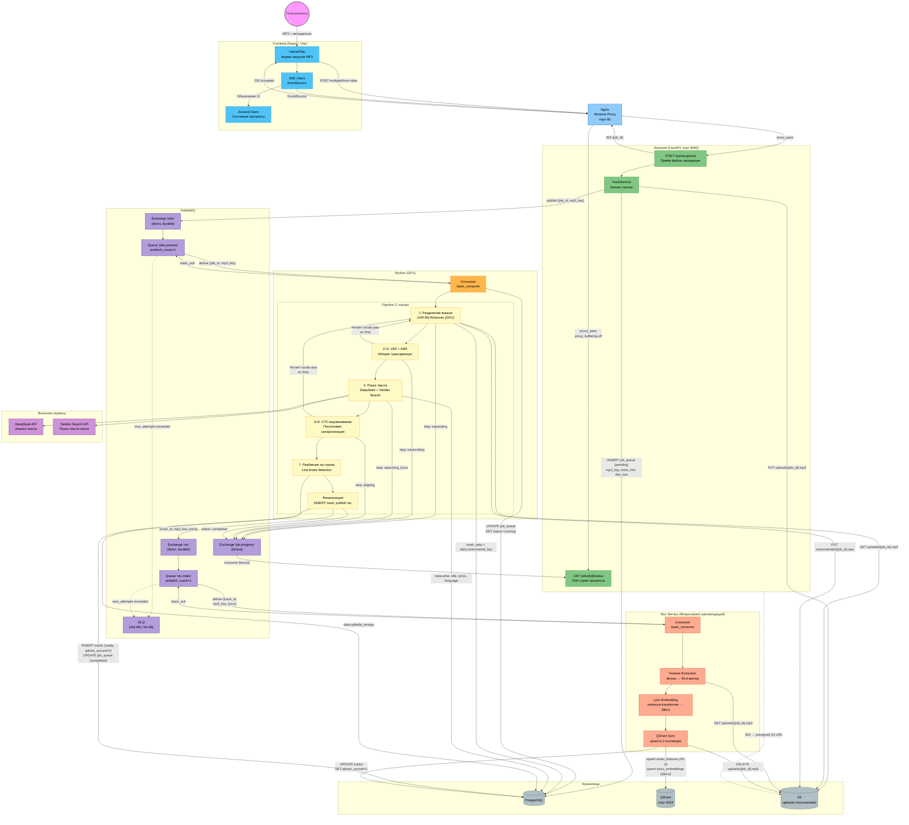

# Схема взаимодействия компонентов: загрузка и обработка MP3

## Потоки данных между компонентами

| Откуда | Куда | Что передаётся |
|--------|------|----------------|
| Frontend → Nginx | `POST /tracks/upload` | MP3 файл (≤50MB), artist, title |
| Nginx → Backend | proxy_pass | Тело запроса без буферизации |
| Backend → S3 | PUT | `uploads/{job_id}.mp3` |
| Backend → PostgreSQL | INSERT | `job_queue` (pending, mp3_key, hints) |
| Backend → RabbitMQ | publish → "jobs" | `{job_id, mp3_key}` |
| Backend → Frontend | 202 response | `{job_id}` |
| RabbitMQ → SSE Endpoint | consume (fanout) | `{job_id, step, progress}` |
| SSE Endpoint → Frontend | SSE events | `status` / `completed` / `error` |
| RabbitMQ → Worker | deliver из "jobs.process" | `{job_id, mp3_key}` |
| Worker → PostgreSQL | UPDATE (каждый шаг) | `current_step`, `progress`, промежуточные данные в `job_queue.data` |
| Worker → PostgreSQL | INSERT (финализация) | Готовый трек в `tracks` (`qdrant_synced=0`) |
| Worker → S3 | GET / PUT / DELETE | Чтение MP3, запись instrumental, удаление оригинала |
| Worker → RabbitMQ | publish → "rec" | `{track_id, mp3_key, lyrics}` |
| Worker → RabbitMQ | basic_ack | Подтверждение обработки |
| RabbitMQ → Rec Service | deliver из "rec.index" | `{track_id, mp3_key, lyrics}` |
| Rec Service → S3 | GET + DELETE | `uploads/{job_id}.mp3` (скачать, после обработки удалить) |
| Rec Service → QDrant | upsert × 2 | `audio_features` (45-d) + `lyrics_embeddings` (384-d) |
| Rec Service → PostgreSQL | UPDATE | `tracks SET qdrant_synced=1` |
| Worker/Rec Service → DeepSeek | HTTP | ASR-текст → текст песни |
| Backend → браузер → S3 | 302 redirect | Presigned URL для аудио-стриминга |

## Поток обработки

```mermaid
flowchart LR
    classDef worker fill:#FFF3E0,stroke:#E65100
    classDef rec fill:#FFEBEE,stroke:#C62828
    classDef handoff fill:#E8F5E9,stroke:#2E7D32

    SEP["1. Separation"]:::worker
    VAD["2+3. VAD + ASR"]:::worker
    LYR["4. Lyrics"]:::worker
    CTC["5+6. CTC Align"]:::worker
    LB["7. Line Breaks"]:::worker
    FIN["Финализация<br/>INSERT track<br/>publish → rec"]:::handoff
    FE["Feature Extraction<br/>librosa → 45-d"]:::rec
    EMB["Lyric Embedding<br/>384-d"]:::rec
    QD["QDrant Sync"]:::rec

    SEP --> VAD --> LYR --> CTC --> LB --> FIN
    FIN -- "RabbitMQ" --> FE --> EMB --> QD
```

**Worker** (оранжевый) обрабатывает аудио и текст → создаёт готовый трек.
**Rec Service** (красный) индексирует фичи и эмбеддинги фоново — не блокирует пользователя.
Точка передачи (зелёный) — финализация воркера: INSERT трека + publish в exchange `rec`.
