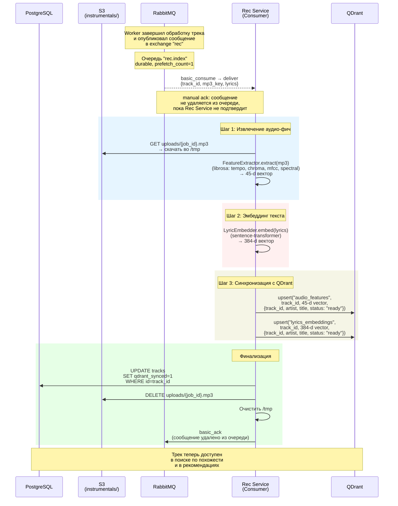

# Диаграмма последовательности: индексация рекомендаций (Rec Service)



## Ключевые детали

### Входное сообщение
Rec Service получает из очереди `rec.index`:
```json
{
  "track_id": "uuid",
  "mp3_key": "uploads/{job_id}.mp3",
  "lyrics": "полный текст песни"
}
```

### Шаги обработки
1. **Feature Extraction** — скачивает оригинальный MP3 из S3, извлекает 45-мерный вектор (librosa: tempo, chroma, mfcc, spectral centroid и т.д.)
2. **Lyric Embedding** — sentence-transformer генерирует 384-мерный вектор из текста
3. **QDrant Sync** — upsert в две коллекции: `audio_features` (45-d, COSINE) и `lyrics_embeddings` (384-d, COSINE)
4. **Финализация** — помечает трек `qdrant_synced=1` в PostgreSQL

### Связь с Worker
- Worker создаёт трек со `status='ready', qdrant_synced=0` и публикует в exchange `rec`
- Rec Service работает **асинхронно** — не блокирует пользователя
- До завершения Rec Service трек доступен для воспроизведения, но не появляется в рекомендациях «похожих треков»

### Идемпотентность
- QDrant upsert перезаписывает вектор по `track_id` — безопасно при повторной обработке
- `UPDATE tracks SET qdrant_synced=1` тоже идемпотентен
- Можно переиндексировать все треки, переопубликовав сообщения в `rec.index`

### Масштабирование
- `prefetch_count=1` — каждый инстанс берёт по одному треку
- Можно запустить N инстансов Rec Service без изменений кода
- CPU-bound задача (librosa + sentence-transformer) — не требует GPU

### Обработка ошибок
- `max_attempts=3` — при краше RabbitMQ делает requeue
- Исчерпание попыток → `basic_nack(requeue=false)` → DLQ (`rec.dlq`)
- При ошибке трек остаётся `qdrant_synced=0` — легко найти и переобработать: `SELECT * FROM tracks WHERE qdrant_synced=0`
