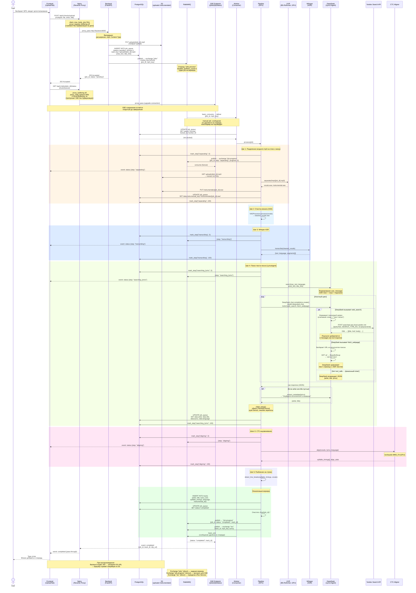

# Диаграмма последовательности: загрузка и обработка MP3 (Worker)

```mermaid
sequenceDiagram
    actor User
    participant FE as Frontend<br/>(UploadTab)
    participant NG as Nginx<br/>(Reverse Proxy)
    participant API as Backend<br/>(FastAPI)
    participant DB as PostgreSQL
    participant S3 as S3<br/>(uploads/ instrumentals/)
    participant RMQ as RabbitMQ
    participant SSE as SSE Endpoint<br/>(/jobs/{id}/status)
    participant WK as Worker<br/>(Consumer)
    participant PL as Pipeline<br/>(GPU)
    participant UVR as UVR<br/>(BS-Roformer, GPU)
    participant ASR as Whisper<br/>(ASR)
    participant LLM as DeepSeek<br/>(Lyrics Agent)
    participant YANDEX as Yandex Search API
    participant CTC as CTC Aligner

    %% ============ UPLOAD ============
    User ->> FE: Выбирает MP3, вводит артиста/название
    FE ->> NG: POST /api/v1/tracks/upload<br/>(multipart: file, artist, title)
    Note over NG: client_max_body_size 50m<br/>proxy_request_buffering off<br/>(стриминг без буферизации на диск)
    NG ->> API: proxy_pass http://backend:8000
    
    Note over API: Валидация:<br/>расширение .mp3, Content-Type

    API ->> S3: PUT uploads/{job_id}.mp3<br/>(multipart upload)
    API ->> DB: INSERT INTO job_queue<br/>(status='pending', priority=1,<br/>mp3_key='uploads/{job_id}.mp3',<br/>artist_hint, title_hint)
    API ->> RMQ: publish → exchange "jobs"<br/>routing_key=priority<br/>{job_id, mp3_key}
    Note over RMQ: Очередь "jobs.process"<br/>durable, prefetch_count=1<br/>(один job на воркера)
    API -->> NG: 202 Accepted<br/>{job_id, status: "pending"}
    NG -->> FE: 202 Accepted

    %% ============ SSE SUBSCRIPTION ============
    FE ->> NG: GET /api/v1/jobs/{job_id}/status<br/>(EventSource)
    Note over NG: proxy_buffering off<br/>proxy_read_timeout 300s<br/>X-Accel-Buffering: no<br/>(пропускает SSE без буферизации)
    NG ->> SSE: proxy_pass (upgrade connection)
    Note over FE,SSE: SSE-соединение остаётся<br/>открытым до завершения

    %% ============ WORKER CONSUME ============
    RMQ -->> WK: basic_consume → deliver<br/>{job_id, mp3_key}
    Note over RMQ,WK: manual ack: сообщение<br/>не удаляется из очереди,<br/>пока воркер не подтвердит

    WK ->> DB: UPDATE job_queue<br/>SET status='running',<br/>locked_by=worker_id
    DB -->> WK: Job (locked)

    WK ->> PL: process(job)

    %% ============ STEP 1: SEPARATION ============
    rect rgb(255, 245, 230)
        Note over PL: Шаг 1: Разделение входного mp3 на плюс и минус
        PL ->> DB: mark_step("separating", 0)
        PL ->> RMQ: publish → exchange "job.progress"<br/>{job_id, step: "separating", progress: 0}
        RMQ -->> SSE: consume (fanout)
        SSE -->> FE: event: status {step: "separating"}
        PL ->> S3: GET uploads/{job_id}.mp3<br/>→ скачать во /tmp
        PL ->> UVR: separate(/tmp/{job_id}.mp3)
        UVR -->> PL: vocals.wav, instrumental.wav
        PL ->> S3: PUT instrumentals/{job_id}.wav
        PL ->> DB: UPDATE job_queue<br/>SET data.instrumental_key='instrumentals/{job_id}.wav'
        PL ->> DB: mark_step("separating", 100)
    end

    %% ============ STEP 2: VAD ============
    rect rgb(230, 245, 255)
        Note over PL: Шаг 2: Очистка вокала (VAD)
        PL ->> PL: VADProcessor.process(vocals)<br/>→ cleaned_vocals.wav
    end

    %% ============ STEP 3: ASR ============
    rect rgb(220, 235, 255)
        Note over PL: Шаг 3: Whisper ASR
        PL ->> DB: mark_step("transcribing", 0)
        PL ->> RMQ: {step: "transcribing"}
        SSE -->> FE: event: status {step: "transcribing"}
        PL ->> ASR: transcribe(cleaned_vocals)
        ASR -->> PL: {text, language, segments[]}
        PL ->> DB: mark_step("transcribing", 100)
    end

    %% ============ STEP 4: LYRICS SEARCH ============
    rect rgb(245, 255, 230)
        Note over PL: Шаг 4: Поиск текста песни (LyricsAgent)
        PL ->> DB: mark_step("searching_lyrics", 0)
        PL ->> RMQ: {step: "searching_lyrics"}
        SSE -->> FE: event: status {step: "searching_lyrics"}

        PL ->> LLM: search(asr_text, language,<br/>artist_hint, title_hint)

        Note over LLM: Формирование user_message:<br/>ASR-текст + язык + подсказки

        loop Агентный цикл
            PL ->> LLM: DeepSeek chat.completions.create()<br/>model=deepseek-chat,<br/>tools=[web_search, fetch_webpage]

            alt DeepSeek вызывает web_search
                LLM ->> LLM: Формирует поисковый запрос<br/>(ключевые слова + "текст песни")
                LLM ->> YANDEX: POST searchapi.api.cloud.yandex.net<br/>{queryText, SEARCH_TYPE_RU, 10 результатов}
                YANDEX -->> LLM: XML → [{title, href, body}, ...]
                Note over LLM: Результат добавляется<br/>в messages как tool response
            else DeepSeek вызывает fetch_webpage
                LLM ->> LLM: Выбирает URL из результатов поиска
                LLM ->> LLM: GET url → BeautifulSoup<br/>→ чистый текст
                Note over LLM: DeepSeek сравнивает<br/>текст страницы с ASR-текстом
            else Нет tool_calls → финальный ответ
                Note over LLM: DeepSeek возвращает JSON:<br/>{artist, title, lyrics}
            end
        end

        LLM -->> PL: raw response (JSON)

        opt Если artist или title пустые
            PL ->> LLM: _extract_metadata(lyrics)<br/>→ "Определи исполнителя и название"
            LLM -->> PL: {artist, title}
        end

        Note over PL: clean_lyrics():<br/>убрать [Verse]/[Chorus],<br/>шум Genius, лишние переносы

        PL ->> DB: UPDATE job_queue<br/>SET data.artist, data.title,<br/>data.lyrics, data.language
        PL ->> DB: mark_step("searching_lyrics", 100)
    end

    %% ============ STEPS 5: CTC ALIGNMENT ============
    rect rgb(255, 230, 245)
        Note over PL: Шаги 5: CTC-выравнивание
        PL ->> DB: mark_step("aligning", 0)
        PL ->> RMQ: {step: "aligning"}
        SSE -->> FE: event: status {step: "aligning"}
        PL ->> CTC: align(vocals, lyrics, language)
        Note over CTC: torchaudio MMS_FA (GPU)
        CTC -->> PL: syllable_timings[], align_stats
        PL ->> DB: mark_step("aligning", 100)
    end

    %% ============ STEP 6: LINE BREAKS ============
    rect rgb(240, 240, 255)
        Note over PL: Шаг 6: Разбиение на строки
        PL ->> PL: detect_line_breaks(syllable_timings, vocals)
    end

    %% ============ WORKER FINALIZATION ============
    rect rgb(230, 255, 230)
        Note over PL: Финализация воркера
        PL ->> DB: INSERT INTO tracks<br/>(artist, title, lyrics_text,<br/>syllable_timings, language,<br/>instrumental_key
        PL ->> DB: UPDATE job_queue<br/>SET status='completed'
        PL ->> PL: Очистить /tmp/{job_id}.*
        PL ->> RMQ: publish → "job.progress"<br/>{job_id, status: "completed", track_id}
        PL ->> RMQ: publish → exchange "rec"<br/>{track_id, mp3_key, lyrics}
        WK ->> RMQ: basic_ack<br/>(сообщение удалено из очереди)
    end

    RMQ -->> SSE: {status: "completed", track_id}
    SSE -->> NG: event: completed<br/>{job_id, track_id, clip_url}
    NG -->> FE: event: completed (pass-through)
    FE -->> User: Трек готов<br/>Можно добавить в очередь

    %% ============ AUDIO PLAYBACK ============
    Note over FE,S3: При воспроизведении:<br/>Backend отдаёт 302 → presigned S3 URL<br/>→ браузер стримит напрямую из S3

    %% ============ RabbitMQ: EXCHANGES ============
    Note over RMQ: Exchange "jobs" (direct) — задания воркеру<br/>Exchange "job.progress" (fanout) — прогресс для SSE<br/>Exchange "rec" (direct) — передача в Rec Service
```
