# Диаграмма последовательности: загрузка и обработка MP3

```mermaid
sequenceDiagram
    actor User
    participant FE as Frontend<br/>(UploadTab)
    participant NG as Nginx<br/>(Reverse Proxy)
    participant API as Backend<br/>(FastAPI)
    participant DB as PostgreSQL
    participant S3 as S3<br/>(uploads/ instrumentals/)
    participant RMQ as RabbitMQ
    participant SSE as SSE Endpoint<br/>(/jobs/{id}/status)
    participant WK as Worker<br/>(Consumer)
    participant PL as Pipeline<br/>(GPU)
    participant UVR as UVR<br/>(BS-Roformer, GPU)
    participant ASR as Whisper<br/>(ASR)
    participant LLM as DeepSeek + Yandex<br/>(Lyrics Agent)
    participant CTC as CTC Aligner
    participant RS as Rec Service<br/>(Микросервис рекомендаций)
    participant QD as QDrant

    %% ============ UPLOAD ============
    User ->> FE: Выбирает MP3, вводит артиста/название
    FE ->> NG: POST /api/v1/tracks/upload<br/>(multipart: file, artist, title)
    Note over NG: client_max_body_size 50m<br/>proxy_request_buffering off<br/>(стриминг без буферизации на диск)
    NG ->> API: proxy_pass http://backend:8000
    
    Note over API: Валидация:<br/>расширение .mp3, Content-Type,<br/>размер ≤ 50 MB

    API ->> S3: PUT uploads/{job_id}.mp3<br/>(multipart upload)
    API ->> DB: INSERT INTO job_queue<br/>(status='pending', priority=1,<br/>mp3_key='uploads/{job_id}.mp3',<br/>artist_hint, title_hint)
    Note over DB: Запись в tracks НЕ создаётся —<br/>все промежуточные данные<br/>хранятся в job_queue
    API ->> RMQ: publish → exchange "jobs"<br/>routing_key=priority<br/>{job_id, mp3_key}
    Note over RMQ: Очередь "jobs.process"<br/>durable, prefetch_count=1<br/>(один job на воркера)
    API -->> NG: 202 Accepted<br/>{job_id, status: "pending"}
    NG -->> FE: 202 Accepted

    %% ============ SSE SUBSCRIPTION ============
    FE ->> NG: GET /api/v1/jobs/{job_id}/status<br/>(EventSource)
    Note over NG: proxy_buffering off<br/>proxy_read_timeout 300s<br/>X-Accel-Buffering: no<br/>(пропускает SSE без буферизации)
    NG ->> SSE: proxy_pass (upgrade connection)
    Note over FE,SSE: SSE-соединение остаётся<br/>открытым до завершения<br/>(таймаут 5 мин)

    %% ============ WORKER CONSUME ============
    RMQ -->> WK: basic_consume → deliver<br/>{job_id, mp3_key}
    Note over RMQ,WK: manual ack: сообщение<br/>не удаляется из очереди,<br/>пока воркер не подтвердит

    WK ->> DB: UPDATE job_queue<br/>SET status='running',<br/>locked_by=worker_id
    DB -->> WK: Job (locked)

    WK ->> PL: process(job)

    %% ============ STEP 1: SEPARATION ============
    rect rgb(255, 245, 230)
        Note over PL: Шаг 1: Разделение вокала
        PL ->> DB: mark_step("separating", 0)
        PL ->> RMQ: publish → exchange "job.progress"<br/>{job_id, step: "separating", progress: 0}
        RMQ -->> SSE: consume (fanout)
        SSE -->> FE: event: status {step: "separating"}
        PL ->> S3: GET uploads/{job_id}.mp3<br/>→ скачать во /tmp
        PL ->> UVR: separate(/tmp/{job_id}.mp3)
        UVR -->> PL: vocals.wav, instrumental.wav
        PL ->> S3: PUT instrumentals/{job_id}.wav
        PL ->> DB: UPDATE job_queue<br/>SET data.instrumental_key='instrumentals/{job_id}.wav'
        PL ->> DB: mark_step("separating", 100)
        Note over PL: Освобождение VRAM (UVR cleanup)
    end

    %% ============ STEPS 2+3: VAD + ASR ============
    rect rgb(230, 245, 255)
        Note over PL: Шаги 2+3: VAD + Whisper ASR
        PL ->> DB: mark_step("transcribing", 0)
        PL ->> RMQ: {step: "transcribing"}
        SSE -->> FE: event: status {step: "transcribing"}
        PL ->> PL: VADProcessor.process(vocals)<br/>→ cleaned_vocals.wav
        PL ->> ASR: transcribe(cleaned_vocals)
        ASR -->> PL: {text, language, segments[]}
        PL ->> DB: mark_step("transcribing", 100)
        Note over PL: Освобождение VRAM (Whisper cleanup)
    end

    %% ============ STEP 5: LYRICS SEARCH ============
    rect rgb(245, 255, 230)
        Note over PL: Шаг 5: Поиск текста песни (LyricsAgent)
        PL ->> DB: mark_step("searching_lyrics", 0)
        PL ->> RMQ: {step: "searching_lyrics"}
        SSE -->> FE: event: status {step: "searching_lyrics"}

        PL ->> LLM: search(asr_text, language,<br/>artist_hint, title_hint)

        Note over LLM: Формирование user_message:<br/>ASR-текст + язык + подсказки

        loop Агентный цикл (до 15 итераций)
            PL ->> LLM: DeepSeek chat.completions.create()<br/>model=deepseek-chat,<br/>tools=[web_search, fetch_webpage]

            alt DeepSeek вызывает web_search
                LLM ->> LLM: Формирует поисковый запрос<br/>(ключевые слова + "текст песни")
                LLM ->> YANDEX: POST searchapi.api.cloud.yandex.net<br/>{queryText, SEARCH_TYPE_RU, 10 результатов}
                YANDEX -->> LLM: XML → [{title, href, body}, ...]
                Note over LLM: Результат добавляется<br/>в messages как tool response
            else DeepSeek вызывает fetch_webpage
                LLM ->> LLM: Выбирает URL из результатов поиска
                LLM ->> LLM: GET url → BeautifulSoup<br/>→ чистый текст (≤12000 символов)
                Note over LLM: DeepSeek сравнивает<br/>текст страницы с ASR-текстом
            else Нет tool_calls → финальный ответ
                Note over LLM: DeepSeek возвращает JSON:<br/>{artist, title, lyrics}
            end
        end

        LLM -->> PL: raw response (JSON или текст)

        Note over PL: Парсинг ответа (3 fallback):<br/>1. JSON parse<br/>2. Regex extraction<br/>3. Plain text как lyrics

        opt Если artist или title пустые
            PL ->> LLM: _extract_metadata(lyrics)<br/>→ "Определи исполнителя и название"
            LLM -->> PL: {artist, title}
        end

        Note over PL: clean_lyrics():<br/>убрать [Verse]/[Chorus],<br/>шум Genius, лишние переносы

        PL ->> DB: UPDATE job_queue<br/>SET data.artist, data.title,<br/>data.lyrics, data.language
        PL ->> DB: mark_step("searching_lyrics", 100)
    end

    %% ============ STEPS 6+7: CTC ALIGNMENT ============
    rect rgb(255, 230, 245)
        Note over PL: Шаги 6+7: CTC-выравнивание
        PL ->> DB: mark_step("aligning", 0)
        PL ->> RMQ: {step: "aligning"}
        SSE -->> FE: event: status {step: "aligning"}
        PL ->> CTC: align(vocals, lyrics, language)
        Note over CTC: torchaudio MMS_FA (GPU)
        CTC -->> PL: syllable_timings[], align_stats
        PL ->> DB: mark_step("aligning", 100)
    end

    %% ============ STEP 8: LINE BREAKS ============
    rect rgb(240, 240, 255)
        Note over PL: Шаг 8: Разбиение на строки
        PL ->> PL: detect_line_breaks(syllable_timings, vocals)
        PL ->> DB: UPDATE job_queue<br/>SET data.syllable_timings
    end

    %% ============ WORKER FINALIZATION ============
    rect rgb(230, 255, 230)
        Note over PL: Финализация воркера
        PL ->> DB: INSERT INTO tracks<br/>(artist, title, lyrics_text,<br/>syllable_timings, language,<br/>instrumental_key,<br/>status='ready', source='user_upload')
        Note over DB: Трек создаётся ТОЛЬКО здесь —<br/>сразу со всеми данными,<br/>но qdrant_synced=0
        PL ->> DB: UPDATE job_queue<br/>SET status='completed',<br/>track_id=NEW.id, result={...}
        PL ->> PL: Очистить /tmp/{job_id}.*
        PL ->> RMQ: publish → "job.progress"<br/>{job_id, status: "completed", track_id}
        PL ->> RMQ: publish → exchange "rec"<br/>{track_id, mp3_key, lyrics}
        WK ->> RMQ: basic_ack<br/>(сообщение удалено из очереди)
    end

    RMQ -->> SSE: {status: "completed", track_id}
    SSE -->> NG: event: completed<br/>{job_id, track_id, clip_url}
    NG -->> FE: event: completed (pass-through)
    Note over FE: track_id появляется впервые —<br/>до этого фронтенд знал только job_id
    FE -->> User: ✓ Трек готов!<br/>Можно добавить в очередь

    %% ============ REC SERVICE: ASYNC ============
    rect rgb(255, 240, 240)
        Note over RS: Микросервис рекомендаций<br/>(асинхронно, после завершения воркера)

        Note over RMQ: Очередь "rec.index"<br/>durable, prefetch_count=1
        RMQ -->> RS: basic_consume → deliver<br/>{track_id, mp3_key, lyrics}

        %% Feature Extraction
        RS ->> S3: GET uploads/{job_id}.mp3
        RS ->> RS: FeatureExtractor.extract(instrumental)<br/>(45-d librosa вектор)

        %% Lyric Embedding
        RS ->> RS: LyricEmbedder.embed(lyrics)<br/>(384-d sentence-transformer вектор)

        %% QDrant Sync
        RS ->> QD: upsert("audio_features",<br/>track_id, 45-d vector, payload)
        RS ->> QD: upsert("lyrics_embeddings",<br/>track_id, 384-d vector, payload)

        RS ->> DB: UPDATE tracks<br/>SET qdrant_synced=1<br/>WHERE id=track_id
        RS ->> S3: DELETE uploads/{job_id}.mp3
        RS ->> RMQ: basic_ack
    end

    %% ============ AUDIO PLAYBACK ============
    Note over FE,S3: При воспроизведении:<br/>Backend отдаёт 302 → presigned S3 URL<br/>→ браузер стримит напрямую из S3

    %% ============ RabbitMQ: EXCHANGES ============
    Note over RMQ: Три exchange:<br/>• "jobs" (direct) — задания воркеру<br/>• "rec" (direct) — задания Rec Service<br/>• "job.progress" (fanout) — прогресс для SSE
```

## Ключевые детали

### S3 (Object Storage)
- **Бакет-структура**: `uploads/{track_id}.mp3` (оригиналы, временно), `instrumentals/{track_id}.wav` (постоянно)
- **Загрузка**: Backend делает `PUT` через S3 SDK (multipart upload для файлов >5 MB)
- **Worker**: скачивает MP3 из S3 во `/tmp` для обработки, загружает instrumental обратно, удаляет оригинал
- **Воспроизведение**: Backend генерирует presigned URL (TTL ~1ч) → клиент стримит напрямую из S3, минуя Backend/Nginx
- **Временные файлы**: vocals, cleaned_vocals хранятся только в `/tmp` воркера — в S3 не попадают
- **Lifecycle policy**: `uploads/` — auto-delete через 24ч (страховка от зависших заданий)

### Nginx (Reverse Proxy)
- **Роутинг**: `/api/v1/*` → `proxy_pass http://backend:8000`, остальное → статика фронтенда
- **Загрузка MP3**: `client_max_body_size 50m`, `proxy_request_buffering off` — файл стримится напрямую в FastAPI без промежуточной записи на диск Nginx
- **SSE**: `proxy_buffering off`, `proxy_read_timeout 300s`, заголовок `X-Accel-Buffering: no` — события проходят к клиенту без задержки
- **Аудио-стриминг**: Backend отдаёт 302 с presigned S3 URL — аудио-трафик идёт напрямую из S3 в браузер

### RabbitMQ (Брокер сообщений)
- **Exchange "jobs"** (direct, durable): Backend публикует задание при загрузке → очередь `jobs.process` с `prefetch_count=1` — каждый воркер берёт по одному заданию
- **Exchange "rec"** (direct, durable): Worker публикует после финализации → очередь `rec.index` → Rec Service извлекает фичи, эмбеддинги, синхронизирует QDrant
- **Exchange "job.progress"** (fanout): Worker публикует прогресс на каждом шаге → SSE-эндпоинт подписан через exclusive queue с фильтром по `job_id`
- **Manual ack**: сообщение остаётся в очереди до `basic_ack` после успешной обработки. При краше — RabbitMQ автоматически requeue другому consumer
- **Dead Letter Queue**: после `max_attempts` отказов сообщение перемещается в `jobs.dlq` / `rec.dlq` для ручного разбора
- **Приоритеты**: `x-max-priority=10` на очереди `jobs.process` — высокоприоритетные задания обрабатываются первыми

### Прогресс (SSE + RabbitMQ)
- **Механизм**: Worker публикует `{job_id, step, progress}` в exchange `job.progress` → SSE-эндпоинт подписан на fanout exchange → мгновенно пушит `event: status` клиенту
- **Параллельно**: Worker пишет `current_step` + `progress` в `job_queue` (PostgreSQL) — для восстановления состояния при переподключении SSE
- **События**: `status` (прогресс), `completed` (успех), `error` (ошибка/not_found/timeout)
- **Таймаут**: 5 минут на SSE-стрим

### Rec Service (Микросервис рекомендаций)
- **Зона ответственности**: извлечение аудио-фич (librosa, 45-d), эмбеддинг текста (sentence-transformer, 384-d), синхронизация с QDrant
- **Запуск**: Worker публикует `{track_id, mp3_key, lyrics}` в exchange `rec` после финализации трека
- **Не блокирует пользователя**: трек уже в статусе `ready` и доступен для воспроизведения; рекомендации подтягиваются фоново
- **Идемпотентность**: повторная обработка безопасна — QDrant upsert перезаписывает вектор по `track_id`
- **Независимое масштабирование**: можно запустить несколько инстансов Rec Service без влияния на Worker

### Управление VRAM (GPU mode)
- После каждого GPU-шага вызывается `cleanup()` для освобождения памяти
- UVR → cleanup → Whisper → cleanup → CTC → cleanup

### job_queue как staging-таблица
- **При загрузке**: Backend создаёт только запись в `job_queue` с метаданными (`mp3_key`, `artist_hint`, `title_hint`) — в `tracks` ничего не пишет
- **Во время обработки**: все промежуточные результаты сохраняются в поле `data` (JSONB) записи `job_queue` — mp3_key, instrumental_key, lyrics, syllable_timings, language и т.д.
- **При завершении воркера**: INSERT готового трека в `tracks` (`qdrant_synced=0`) + UPDATE `job_queue.track_id` + publish в exchange `rec`
- **После Rec Service**: UPDATE `tracks SET qdrant_synced=1` — трек появляется в рекомендациях
- **Результат**: таблица `tracks` содержит **только готовые** треки; `qdrant_synced` отслеживает индексацию отдельно
- **Frontend**: до завершения знает только `job_id`; `track_id` появляется в SSE `completed`-событии

### Обработка ошибок
- При ошибке поиска текста: трек в `tracks` не создаётся, задание уходит в DLQ
- `max_attempts=3` — при краше воркера RabbitMQ делает requeue, при исчерпании попыток → `basic_nack(requeue=false)` → Dead Letter Queue
- **DLQ** (`jobs.dlq`): неудачные задания сохраняются для ручного анализа, не теряются

### Отличия от SQLite-версии
- **Доставка заданий**: RabbitMQ push вместо поллинга БД — воркер получает задание мгновенно
- **Прогресс**: RabbitMQ fanout exchange вместо PG `LISTEN/NOTIFY` — не зависит от коннекта к БД
- **Гарантия доставки**: manual ack + requeue при краше — задание не потеряется даже при падении воркера
- **Масштабирование**: `prefetch_count=1` + round-robin между consumers — добавление воркеров без изменения кода
- **Приоритеты**: `x-max-priority` на уровне очереди RabbitMQ вместо `ORDER BY priority` в SQL
- **Отложенное создание трека**: INSERT в `tracks` только при успешном завершении — нет "мусорных" pending-записей
- **JSONB**: промежуточные данные в `job_queue.data`, финальные — в `tracks`
